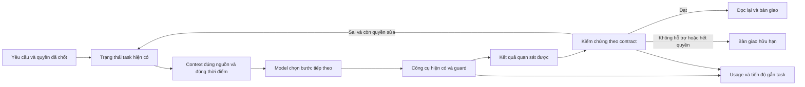

<!-- language: vi; english-index: docs/en/README.md -->

# Kế hoạch cải thiện lõi Piagent: giải quyết việc đúng, ít lãng phí hơn

**Plan ID:** PCL-2026-09-06 · **Version:** 1.1 · **Ngày nghiên cứu:** 2026-09-06  
**Trạng thái:** PCL_A_APPROVED / OFFLINE_IMPLEMENTED / QUALIFICATION_RECORDED_SEPARATELY  
**Repo triển khai duy nhất:** `/Users/vtamm/Documents/piagent-35-recovery-20260831T090020Z/implementation`  
**Liên quan:** PRB-108-2026-09-06; kế hoạch này không thay thế, mở lại hay tự mở rộng quyền của PRB.

## 1. Quyết định đề xuất

Đưa trọng tâm về **khả năng hoàn thành công việc thực tế của cùng một model khi chạy qua Piagent**. Ưu tiên sửa phần làm model thiếu thông tin, lặp việc, dùng công cụ sai hoặc mất trạng thái; chỉ giữ tối ưu token khi chất lượng công việc được bảo toàn.

Không có cơ sở để kết luận toàn bộ lõi Piagent đã lỗi thời. Repo đã có retrieval, context governor, durable task state, edit freshness, phase tools, model policy và progress guard. Vấn đề cụ thể là mức tích hợp, hiệu quả thực tế và tính tương thích chưa được chứng minh đủ. Vì vậy, đề xuất nâng cấp có chọn lọc trên nền hiện tại, không viết lại agent framework.

“Cải thiện logic của model” trong kế hoạch này nghĩa là giúp model **hiểu đúng yêu cầu, lấy đúng bằng chứng, chọn bước có ích, sửa đúng nguyên nhân và kiểm tra kết quả**. Kế hoạch không thay trọng số model và không hứa tăng năng lực suy luận nội tại hoặc giải mọi lỗi trong một lần.

Đề xuất đợt đầu gồm C0–C5 dưới đây, với C6 là nhánh tương thích cần hoàn tất trước khi khóa candidate phát hành. C7 là đánh giá sản phẩm sau khi có quyền tương ứng; nghiên cứu này chưa tạo quyền gọi provider. Tất cả thực hiện tuần tự, local, single-agent.

## 2. Cơ sở nghiên cứu và giới hạn

Đã đối chiếu 10 hệ coding agent: Pi, Codex, Claude Code, Cursor, Aider, mini-SWE-agent, OpenHands SDK, Gemini CLI, OpenCode và Cline. Tám repo công khai được ghim commit; đọc các đoạn triển khai liên quan trong 13 file nguồn và một changelog. Claude Code và Cursor được nghiên cứu qua bài kỹ thuật của tác giả, không coi đó là audit mã nguồn lõi. Bốn bài nghiên cứu được dùng ở mức abstract/phạm vi kết luận để kiểm tra giả định, không coi là tái lập thí nghiệm.

Danh mục nguồn, mức đọc, SHA và đối chiếu với Piagent nằm trong [bản nghiên cứu](piagent-core-reasoning-research-2026-09-06.md) và [manifest nguồn](piagent-core-research-sources-2026-09-06.json). Các phần thiết kế bên dưới là tổng hợp đề xuất cho Piagent; kết quả của tác giả khác không phải bằng chứng Piagent sẽ đạt mức tiết kiệm tương tự.

Các nguồn thay đổi quyết định thiết kế rõ nhất:

- Codex giải thích tác động của prefix/tool order lên cache và cách quản lý lịch sử. Piagent cần dùng telemetry ở payload thực tế cùng usage, thay vì suy từ độ dài prompt. [OpenAI, agent loop](https://openai.com/index/unrolling-the-codex-agent-loop/)
- Anthropic ghi nhận thay đổi effort, mất reasoning khi resume và chỉ dẫn giảm verbosity có thể làm giảm chất lượng. Không mặc định hạ effort, cắt lịch sử hoặc ép trả lời ngắn để đạt chỉ tiêu token. [Postmortem 23/04/2026](https://www.anthropic.com/engineering/april-23-postmortem)
- Cursor mô tả lấy context theo nhu cầu và đánh giá thêm bằng công việc thực tế. Piagent cần nguồn chi tiết có thể đọc lại và ghi nhận phần sửa phải làm lại sau bàn giao. [Dynamic context](https://cursor.com/blog/dynamic-context-discovery), [harness improvement](https://cursor.com/blog/continually-improving-agent-harness)
- Aider cho thấy định dạng sửa code là một biến riêng; mini-SWE-agent cho thấy lõi đơn giản vẫn là đối chứng đáng xem xét. Không giả định thêm orchestration luôn tốt hơn. [Aider edit formats](https://aider.chat/docs/more/edit-formats.html), [mini-SWE-agent](https://mini-swe-agent.com/latest/)

## 3. Điểm xuất phát phải giữ nguyên

| Hạng mục | Trạng thái đối chiếu |
|---|---|
| HEAD / branch | `c3a4427396984554eb1571e687caba0f831176ae` / `codex/piagent-35-recovery-20260831` |
| Working tree trước khi thêm bộ tài liệu này | 153 đường dẫn thay đổi; 0 staged. Mốc 95 là checkpoint cũ, không phải trạng thái hiện tại |
| E14 | `benchmark-validity-recovery-20260906T135741Z`; giữ nguyên evidence đã niêm phong |
| Full qualification lịch sử | 4.820 PASS / 22 FAIL / 222 SKIP; không có full qualification mới trong đợt nghiên cứu |
| E14 targeted | Worker 46 PASS; NDJSON/replay thực SDK 4 PASS; docs native command 6 PASS và schema/composite 268 PASS. Đây là bằng chứng phạm vi tương ứng |
| Docs còn mở | Chưa hoàn tất integration docs qua toàn bộ hành trình SDK đã cấu hình |
| Contract còn mở | Khác biệt expiry/reference về arity; 18 kỳ vọng correct-completion mặc định đỏ vẫn phải được giữ |
| R5 offline | 108 scripted sessions / 54 pairs; không chứng minh suy luận hay token thực của model |
| Run-6 | 13 started / 12 accepted exact / 1 unknown; `INVALID_MEASUREMENT`, không resume/retry/regrade/reuse/merge |
| D-026 | 76/184 đã dùng; fresh tối đa 108, 0 retry, 3.000.000 fresh token / 4 giờ; 12 → 18 → 54 → 108; unknown mới thì dừng |
| Quyền paid | D-026 khóa candidate cũ. Candidate mới cần rebind/qualification đúng identity; kế hoạch PCL không cấp quyền đó |
| Runtime đang dùng | Pi SDK 0.84.1; xem xét 0.85.1 qua kiểm tra tương thích riêng, chưa nâng |

E14 manifest SHA-256: `995bcc902f89e40e7ea0828b6e6d9fdcc9098bfb5f35ee7418624aa6ba4ab5fa`.

Chỉ thêm tài liệu trong đợt này. Tài liệu mới làm thay đổi selection của toàn candidate; không mô tả working tree mới là candidate E14 đã được qualification. Không sửa checkpoint E14 để làm nó trông khớp với nội dung mới.

## 4. Mục tiêu sản phẩm và cách biết có ích

### 4.1 Kết quả cần đạt

1. Model hoàn thành đúng nhiều công việc hơn ngay trong lần bàn giao đầu, với cùng cấu hình model/effort và phạm vi quyền.
2. Khi chưa đúng, model nhận được bằng chứng lỗi đủ dùng và sửa đúng phần liên quan; không đọc lại toàn repo hoặc sửa lại phần đã đạt vô cớ.
3. Sau pause/resume/compaction, model tiếp tục đúng việc, nhớ ràng buộc và không lặp side effect.
4. Tổng token, chi phí, thời gian và công sửa của người dùng giảm trên tập công việc tương đương.
5. Lỗi đo, lỗi môi trường và lỗi sản phẩm được phân biệt; thiếu usage phải hiện là unknown, không biến thành 0.

### 4.2 Chỉ số chính

| Chỉ số | Định nghĩa / cách dùng |
|---|---|
| First-handoff correctness | Việc đạt contract và đọc lại kết quả đúng ở lần bàn giao đầu; báo riêng theo loại việc/model |
| Eventual correctness | Đạt sau số vòng sửa đã cho phép; không gộp với thành công ngay lần đầu |
| False completion | Báo completed khi sai/thiếu/không có quyền; mọi trường hợp phát hiện được đều chặn phát hành |
| Cost per accepted task | Tổng chi phí của **mọi attempt trong cohort**, gồm thất bại và chi phí điều phối, chia số task đạt; bằng 0 task đạt thì không tính tỷ lệ hữu hạn |
| Token per assigned task | Tổng token theo các trường provider có thể đối soát / toàn bộ task được giao; không chỉ chọn những task thành công |
| Matched-success cost | Chi phí trên những cặp mà cả hai biến thể đều đúng; chỉ là chỉ số phụ vì có selection bias |
| User rework | Task phải mở lại, lý do, thời gian sửa tay, mức thay đổi bị bỏ/sửa; việc user giữ code không tự chứng minh code đúng |
| Latency | Thời gian tổng, thời gian chờ provider/tool/verifier, p50/p95; phân biệt thời gian chờ người dùng |
| Recovery fidelity | Giữ đúng yêu cầu, quyền, nguồn, việc còn mở và trạng thái side effect sau resume |

Đo riêng input/cache-read/cache-write/output/reasoning nếu provider công bố. Không cộng reasoning lần hai khi nó đã nằm trong output. Context occupancy, token ước tính, token provider và tiền thực là bốn loại dữ liệu khác nhau. Giá phải gắn model/provider/thời điểm; unknown không tự nội suy thành exact.

**Chỉ tiêu đề xuất cho đợt đầu:** giảm ít nhất 15% cost per accepted task trên cohort công việc đã khóa, giữ chất lượng không kém baseline và không xuất hiện false completion mới. Đây là mục tiêu cần kiểm nghiệm, không phải kết quả hay thay đổi threshold PRB. Nếu dữ liệu đủ lớn, dùng khoảng tin cậy cho chênh lệch chất lượng; margin đề xuất tối đa 2 điểm phần trăm, phải chốt trước chạy. Tập nhỏ không đủ chứng minh margin đó: kết quả được ghi inconclusive, không tuyên bố giữ nguyên hiệu năng toàn bộ model.

Không đợi đạt con số tiết kiệm mới công nhận một sửa lỗi correctness cần thiết. Sửa lỗi correctness và tối ưu chi phí có lý do phát hành khác nhau.

## 5. Kiến trúc đích: dùng lại lõi đang có

Model quyết định dựa trên source và observations. Durable task state giữ yêu cầu, quyền và trạng thái; memory chỉ giúp tìm thông tin. Receipt/verifier mới quyết định acceptance trong phạm vi được cấp. Một ghi chú, một lời tự đánh giá hoặc một test do model tự tạo không được tự nâng thành quyền hoàn tất.

## 6. Các gói công việc

Đường dẫn ở phần này tương đối với repo duy nhất ở đầu tài liệu. Đây là **candidate file/hunk dự kiến**, không phải quyền ghi đè cả file. Chỉ sửa hunk có bằng chứng thiếu/sai; ưu tiên không thay đổi module đã đáp ứng.

| Gói | Ưu tiên | Phụ thuộc | Đầu ra |
|---|---|---|---|
| C0 — Khóa phạm vi | Bắt buộc | Đọc plan | Manifest bảo toàn, danh sách invariant, đối chứng và backlog hữu hạn |
| C1 — Nối chi phí với task | Cao nhất | C0 | Báo cáo task có usage, tool count và nguồn số liệu rõ |
| C2 — Payload và context | Cao | C1 | Context hữu ích, cache được quan sát, compaction giữ nghĩa |
| C3 — Công cụ sửa code | Cao | C1, C2 phần liên quan | Ít lỗi đọc/sửa/đọc lại; lỗi công cụ có hành động sửa rõ |
| C4 — Luồng giải quyết và sửa lỗi | Cao | C2–C3 | Vòng xử lý dựa trên evidence, giữ correct/wrong/unsupported |
| C5 — Memory và resume | Vừa | C2, C4 | Tiếp nối công việc đúng sau đổi context/khởi động lại |
| C6 — Tương thích SDK/model | Cao trước freeze | C0, C1 | Phiên bản và payload được kiểm tra; model pin giữ nguyên |
| C7 — Đánh giá sản phẩm, qualification | Sau triển khai | Candidate đã freeze | Quyết định giữ/bỏ từng tối ưu và phát hành có giới hạn rõ |

### C0. Khóa một đợt nâng cấp có thể kết thúc

- Dùng lại E14 và finite register 27 dòng; không mở lại toàn bộ audit. Tạo bảng liên kết lỗi cũ với gói PCL khi thực sự chung nguyên nhân.
- Ghi candidate hunks riêng với baseline hash, lý do, tests liên quan, feature flag nếu phù hợp. Không gom 153 đường dẫn vào một “clean candidate”.
- Chốt nhóm invariant: quyền, source identity, dirty work, model pin, đúng/sai/unsupported, tool-call/result pairing, exact usage, continuation maximum 1.
- Chốt tập công việc ở mục 8 trước khi tối ưu. Những task từng dùng để sửa code thuộc development set.
- **Đóng C0:** có danh sách file/hunk hữu hạn và cách khôi phục đúng phần mới mà không chạm recovery cũ. Không chạy full suite ở C0 chỉ để tìm số PASS.

### C1. Đo đúng tiền/token và việc phải làm lại

**Bằng chứng:** `runtime/product/efficiency-metrics.ts` nhận `exactUsage` nhưng các call site đã đọc không truyền vào; `actualInvocationCounts` và `timeToFirstCorrectEditMs` còn null. Đây là khoảng trống trong báo cáo task, không phải kết luận toàn bộ hệ usage/benchmark thiếu accounting.

**Candidate:** `runtime/product/efficiency-metrics.ts`, `runtime/product/operator-projections.ts`, `runtime/registration/context-commands.ts`; đọc/tận dụng `runtime/session/usage.ts`, các hooks quan sát message/tool và `runtime/trajectory/trajectory-store.ts`. Nếu thiếu cầu nối, thêm module nhỏ cùng khu vực product; không tạo collector cạnh tranh với accounting đã có.

**Hunks dự kiến:** nối usage snapshot vào task bằng taskRunId/request identity; phân biệt delta/cumulative; chống đếm đôi sau replay; ghi tool invocation thực; marker edit→verifier phải gắn đúng source digest. Dùng bảng tổng hợp và metadata được phép, không lưu raw session/reasoning/auth.

**Đóng C1:** fixtures đối soát được success, lỗi parse có thể đã tính phí, abort, late usage, unknown, replay trùng và hai task cùng session. Không thể gắn chắc usage vào task thì giữ unknown. Task report và nguồn runtime khớp; không cần provider để kiểm logic cộng số, nhưng chưa được tuyên bố số thật đã exact end-to-end khi chưa có bằng chứng runtime phù hợp.

### C2. Context đủ dùng, giữ cache và giữ nghĩa

**Tái sử dụng:** `extensions/context-engine.js`, `runtime/context/adaptive-planner.ts`, `runtime/context/context-delivery.ts`, `runtime/hooks/agent-start-hook.ts`, `runtime/session/adaptive-context-governor.ts`, `adaptive-context-ledger.ts`, `runtime/session/system-prompt.ts`, `runtime/model/provider-wire-fingerprint.ts`.

**Candidate hunks:**

1. Lập bản đồ thành phần prompt/tool/context thực sự được gửi. Giữ riêng canonical telemetry và fingerprint có thứ tự tool ở payload; module wire đã tồn tại, không viết thêm bản trùng. Fingerprint tương đương theo relocation không được dùng thay bằng chứng cache hit thực.
2. Bỏ phần hướng dẫn trùng hoặc context tiêm lại **chỉ sau khi chỉ ra invariant nào đã có nơi giữ**. Không sửa nội dung yêu cầu và benchmark prompt/oracle.
3. Giữ pack nhỏ khi đã có path rõ; chỉ mở rộng theo symbol/dependency/evidence thiếu. Index hiện có đã lexical/symbol/RRF; chưa thêm vector database hay embedding service mặc định.
4. Ưu tiên đoạn source hiện hành, phạm vi thay đổi, contract và kết quả liên quan. Kết quả dài dùng phần tóm tắt có cấu trúc kèm tham chiếu đọc lại được trong quyền cho phép; giữ exit code, truncation marker, vị trí lỗi và nguồn.
5. Compaction giữ task truth nguyên nghĩa, open obligations và protocol. Dùng governor hiện có; không sao chép threshold 50%/số token từ agent khác. Kiểm xem compaction SDK và governor có hoạt động chồng lấn trong host thực hay không; chưa coi đó là lỗi đã xác nhận.

**Đóng C2:** các phép biến đổi giữ user correction, tool-call/result pairing, nguồn và quyền; context cũ sau đổi source không được nhận là source mới. Có controls dài/ngắn, code đa ngôn ngữ, mất cache, cold resume. C1 phải cho thấy giảm dữ liệu lặp mà không tăng đọc lại; lợi ích token/model thực chờ C7.

### C3. Công cụ giúp model sửa đúng ngay từ thao tác

**Tái sử dụng:** `runtime/quality/edit-freshness-guard.ts`, `runtime/tools/phase-tool-runtime.ts`, `runtime/tools/phase-tools.ts`, `runtime/hooks/tool-result-retrieval.ts` và tool registrations liên quan được truy ra ở C0.

**Candidate hunks:** chuẩn hóa lỗi đọc/sửa thành reason code + vị trí + current source reference + bước hợp lệ tiếp theo; tránh lặp lại toàn log. Kiểm stale-read trước edit bằng guard đã có. Phân biệt lỗi hunk không khớp, lỗi đường dẫn, tool bị cắt giữa chừng và lỗi code sau khi edit thành công. Nếu SDK đã xử lý đúng thì chỉ nối telemetry/feedback.

Dùng patch/search-replace phù hợp khả năng model đang được pin; không bắt mọi model xuất lại nguyên file. Không tự sửa sang file khác khi path ban đầu sai. Thay đổi format/wrapper ảnh hưởng treatment phải được ghi rõ; không bật ngầm.

Phase tools hiện có cần được kiểm tra tính hữu dụng và cache cost: giảm danh mục có thể giúp chọn tool nhưng thay danh mục liên tục cũng có thể mất cache. Chọn tại ranh giới hợp lệ, không rung cấu hình theo từng câu. Không thêm công cụ chỉ để tăng số tính năng.

**Đóng C3:** xử lý được file đổi sau read, ambiguous match, multi-hunk có phần đã áp, partial output và permission denial; không sửa nhầm file, không phát lại side effect. Đo edit failure và re-read bằng C1. Không nới guard để tạo PASS.

### C4. Cải thiện luồng suy luận bằng trạng thái và phản hồi

**Tái sử dụng:** `runtime/solver/solver-policy.ts`, `solver-shadow.ts`, `runtime/trajectory/*`, `runtime/recovery/recovery-policy.ts`, `semantic-repair-runtime.ts`, `continuation-budget.ts`, `runtime/hooks/completion-hook.ts` và verification runtime hiện có.

**Thay đổi hành vi đề xuất:**

- Việc nhỏ, rõ: đọc đúng vùng → sửa → kiểm tra phù hợp → bàn giao; không bắt qua mọi pha hoặc viết lại một plan dài.
- Việc khó: giữ một bản trạng thái ngắn gồm mục tiêu, điều chưa biết, giả thuyết hiện hành, bằng chứng cần phân biệt và bước kế tiếp. Đây là trạng thái công việc, không yêu cầu lưu chain-of-thought riêng tư.
- Khi fail: xác định lớp lỗi trước; chọn kiểm tra nhỏ nhất có thể bác bỏ giả thuyết. Sửa phần có liên hệ nhân quả; giữ nguyên phần đúng.
- Một bước được coi là tiến bộ khi có source/evidence/nghĩa vụ đổi liên quan. Không dùng số tool call làm đại diện cho chất lượng; không coi lặp test sau sửa source là cùng một lần không tiến bộ.
- Đúng phải được completed theo contract. Wrong phải bị chặn với evidence. Unsupported phải bàn giao hữu hạn, nói rõ capability thiếu; không biến thành completed hay dùng test handoff xanh xóa correct-completion đỏ.

Solver hiện mặc định shadow; nhánh host model routing đã đọc báo `hostBoundary: unavailable`. Không suy từ đề xuất solver thành hành vi đã được enforce. Nếu cần thêm consumer cho recommendation phải ghi thành hunk riêng, chứng minh không làm tăng quyền hoặc tự đổi model.

**Đóng C4:** controls đi qua hành trình task thực cho correct, sai nhưng test yếu xanh, unsupported, stale evidence và repeated signature. Dùng đúng global continuation maximum 1 hiện có; không thêm bộ đếm, không tự tạo lượt model retry. C4 đóng lỗi điều phối, không thay thế model-quality evidence ở C7.

### C5. Memory và tiếp nối có kiểm nguồn

**Tái sử dụng:** `extensions/repository-memory.js`, `runtime/context/repository-memory-hints.ts`, `runtime/recovery/resume-state.ts`, `runtime/session/adaptive-context-ledger.ts`, `runtime/trajectory/trajectory-store.ts`.

Memory hiện đã có citations, expiry, protected-path filtering và lời nhắc advisory. Không xây “bộ nhớ thông minh” thứ hai. Phần cần kiểm là hint còn hữu ích sau rename/source change hay không và model có thật sự đọc lại nguồn trước khi dựa vào nó.

**Candidate hunks:** bổ sung freshness checking vào đúng đường chọn/giao hint nếu thiếu; lưu quyết định đã được xác minh và bằng chứng tối thiểu, giới hạn kích thước/tuổi. Resume phải lấy task state hiện tại, không khôi phục một plan suy đoán hoặc receipt của tree cũ. Không lấy ghi chú model làm authorization.

**Đóng C5:** đổi file, rename, cache cũ, user đổi ý, pause/resume và side effect chưa rõ đều giữ đúng nghĩa vụ. Không replay gửi/gọi bên ngoài khi kết quả chưa rõ. Không đọc raw session/secret để dựng memory cho nghiên cứu này.

### C6. Giữ Piagent phù hợp SDK và model mới

**Candidate:** `package.json`, `package-lock.json` chỉ sau quyết định phiên bản; `runtime/model/capabilities.ts`, `runtime-snapshot.ts`, `provider-wire-fingerprint.ts`, `openai-codex-reasoning.ts`, `model-route-policy.ts` và các tests host/SDK đang có.

Pi 0.85.1 là ứng viên tương thích được ghi nhận trong nguồn release. 0.85.0 từng có lỗi import SDK mà 0.85.1 sửa; “mới nhất” không đủ làm lý do nâng trực tiếp. [Pi releases](https://github.com/earendil-works/pi/releases)

Thực hiện một ma trận contract hữu hạn: import/package closure; hook order; steering/abort; tool-call/result; usage/cache semantics; reasoning/phase/compaction opaque state; cwd/session resume. Không yêu cầu lộ reasoning; chỉ giữ đúng protocol do provider trả. Chỉ chuyển SDK khi contract cần dùng qua được và không mất recovery work.

Model routing đang có bảng lựa chọn cụ thể và bảo toàn explicit pin; mặc định off, host đã đọc không cho auto prelaunch. Đề xuất tách **khả năng protocol** khỏi **xếp hạng chất lượng**: catalog giúp biết hỗ trợ gì, không tự chứng minh model nào giỏi hơn. Giữ model/effort của người dùng; không tự thêm Astra hay đổi sang model rẻ để tạo mức tiết kiệm.

**Đóng C6:** mỗi host/model được ghi supported/unsupported/unknown theo contract; khóa SDK, dependency, payload policy và tests đúng identity. Nếu phải đổi SDK, đối chứng và Piagent trong phép đo causal đều dùng cùng SDK; không đổi SDK cùng một hunk tối ưu context rồi quy toàn bộ lợi ích cho context.

### C7. Đánh giá trên sản phẩm và quyết định phát hành

Chỉ bắt đầu phần phụ thuộc provider khi có quyền riêng phù hợp. Trước đó có thể chuẩn bị task specification, adapter usage và protocol offline; không reserve campaign hoặc tạo paid authority.

Sau C1–C6, khóa candidate và chạy các kiểm tra liên quan theo hunk. Chạy full qualification đúng identity **một lần tại ranh giới freeze**; chỉ chạy lại khi có sửa đổi/failure cụ thể cần xác minh. Giữ toàn bộ fail cũ và lý do; targeted PASS không thay thế full.

Sau đó đánh giá theo mục 8; báo công việc hoàn tất, lỗi còn lại, token/chi phí, latency và phần người dùng phải sửa. Nếu thiếu mẫu hoặc thiếu exact usage thì kết luận giới hạn/inconclusive, không mở thêm lượt để tìm PASS. Hạng mục không có lợi ích hoặc gây hại được tắt phần mới theo manifest hunk, bảo toàn phần phục hồi.

## 7. Danh sách vấn đề hữu hạn cho đợt PCL

Đây là register bổ sung cho vấn đề lõi; không thay finite register PRB 27 dòng.

| ID | Loại / mức bằng chứng | Hướng xử lý | Điều kiện đóng |
|---|---|---|---|
| L01 | Phép đo: task report thiếu exactUsage wiring, tool count và marker edit→verification; xác nhận trong code | C1 nối nguồn hiện có | Đối soát không trùng/mất, unknown được giữ |
| L02 | Context/chi phí: hiệu quả cache và dữ liệu lặp chưa được chứng minh; giả thuyết, đã có wire telemetry | C2 đo rồi tối ưu hunk gây lãng phí | Giảm tổng chi phí có bảo toàn chất lượng, hoặc bác bỏ và không đổi |
| L03 | Context/logic: nguy cơ mất nghĩa ở giao điểm governor–SDK–resume; cần kiểm integration | C2/C5 ma trận bảo toàn | Correct/correction/protocol/nguồn sống qua mọi transition đã khai báo |
| L04 | Công cụ: chưa có bằng chứng đầy đủ về edit failure cost theo model; không coi mọi format là bug | C3 thống kê và sửa đường lỗi có thật | Ít lỗi thao tác, không sửa nhầm file hoặc phát lại phần đã áp |
| L05 | Điều phối: solver có recommendation/shadow, chưa chứng minh giá trị hành vi | C4 kiểm consumer và tối giản pha không cần | Hoàn thành đúng với bước có ích; giữ nguyên quyền/counter |
| L06 | Memory: cơ chế advisory/freshness tồn tại một phần; chưa chứng minh giảm đọc lại | C5 kiểm nguồn và hiệu quả | Hints sai/cũ không dẫn đến acceptance; không có lợi thì giữ/tắt theo baseline |
| L07 | Tương thích: SDK 0.84.1 so với ứng viên mới, model policy cụ thể | C6 qualification hữu hạn | Phiên bản/payload được hỗ trợ rõ; không silent substitution |
| L08 | Bằng chứng sản phẩm: chưa có causal benefit của core và real-work retention cho candidate mới | C7 đối chứng và holdout | Có kết luận theo dữ liệu, kể cả no-benefit/inconclusive |

Mỗi dòng đóng bằng bằng chứng hoặc quyết định “không thay đổi vì giả thuyết bị bác bỏ”. Không cần phải viết code cho đủ tám dòng.

Các việc PRB vẫn mở được quản lý riêng: docs full SDK integration; expiry contract/reference; 18 correct-completion đỏ; full qualification; identity/rebind paid. Research lõi không xóa chúng. Nếu chúng chặn một task sản phẩm đã chọn, giải đúng issue hiện có trước, không mở thêm bộ chứng minh tổng quát.

## 8. Đánh giá thực tế mà không biến toàn bộ dự án thành benchmark

### 8.1 Ba tầng bằng chứng

| Tầng | Trả lời được | Không trả lời được |
|---|---|---|
| Offline contracts/replay | Protocol, accounting, state, guard và lỗi đã tái hiện | Model thật có tự tìm ra lời giải hay không |
| Cùng model + cùng SDK, chỉ thay feature PCL | Đóng góp của cơ chế Piagent trong điều kiện đã khóa | Ưu thế toàn sản phẩm so với Codex ở host khác |
| Công việc sử dụng thực tế và đối chiếu sản phẩm | Người dùng có nhận kết quả hữu ích, ít phải sửa lại hơn | Quan hệ nhân quả của từng module nếu nhiều yếu tố cùng đổi |

PRB Piagent–Codex là so sánh sản phẩm/hệ chạy; không dùng nó một mình để kết luận thuật toán lõi Piagent làm model suy luận tốt hơn.

### 8.2 Corpus công việc đề xuất, chưa cấp session

Khởi đầu với **24 task specifications**, không phải 24 phiên provider đã được phép. Đề xuất 12 development / 12 holdout, chia theo repo hoặc cụm nguyên nhân để tránh biến thể cùng lỗi rơi vào cả hai tập. Đây là đợt kiểm tra khả thi; không đủ chứng minh mọi model không suy giảm 2 điểm phần trăm.

| Nhóm việc | Số spec dự kiến | Kết quả người dùng cần |
|---|---:|---|
| Sửa lỗi trong code có sẵn | 4 | Sửa đúng nguyên nhân, giữ API và hành vi lân cận |
| Tính năng chạm nhiều file | 4 | Luồng hoàn chỉnh, không chỉ unit test xanh |
| Refactor/migration có tương thích | 4 | Giữ nghĩa và cấu trúc dễ bảo trì |
| Debug theo log/dữ liệu lỗi | 4 | Phân biệt runtime, dữ liệu và phép đo |
| Resume sau gián đoạn/user correction | 4 | Tiếp tục đúng, không lặp việc hoặc side effect |
| Docs/config/việc nhỏ | 4 | Hoàn tất nhẹ, đủ và đúng phạm vi |

Mỗi spec có yêu cầu, source identity, tiêu chí hành vi và lệnh kiểm chứng hợp lệ; không tạo private business logic trong core. Chỉ dùng repo/task mà người dùng có quyền chia sẻ; không lấy raw session riêng tư làm dataset. Một task thiếu quyền/không hỗ trợ có expected handoff riêng, không tính là completed.

Nguồn task thực ưu tiên backlog người dùng thường làm và case mới chưa từng dùng sửa core. Nếu chưa có đủ repo sạch quyền, ghi thiếu corpus; không bịa “real-world evidence” từ 24 fixtures.

### 8.3 Đối chứng và số lượt

- Baseline là Piagent hiện tại đóng băng và Pi SDK tối thiểu có cùng quyền/công cụ cần thiết. Không tháo safety guard để tạo baseline rẻ hơn.
- Một phép thử thay một nhóm cơ chế; cùng model snapshot/effort, provider, task, source, quyền, tài nguyên, timeout và cache condition. Ghi rõ thứ tự/cold-warm; tránh memory hoặc kết quả lần trước rò sang lần sau.
- Chọn tối đa hai giả thuyết tối ưu đáng giá nhất sau dữ liệu C1; không chạy toàn bộ tích Descartes model × prompt × tool × compaction.
- Trước bất kỳ lượt trả phí nào, lập số lượt tối đa từ số spec × biến thể × model × repetition và toàn bộ chi phí phụ; chốt ngân sách, stopping rules và phân tích trước chạy. Kế hoạch này chưa chọn hay cấp một campaign mới.
- Sau development chỉ có một đợt holdout theo protocol đã khóa. Nếu nhìn failure holdout rồi sửa, nó chuyển thành regression/development; cần holdout mới được chốt riêng, không chạy lại cùng đề rồi gọi là unseen.

**Quan hệ với 108:** không thêm canary ngoài 108; không tự chuyển các mốc 12 → 18 → 54 → 108 sang corpus này. Nếu chọn candidate PCL cho PRB thì cần quyết định thay identity/treatment và rebind đúng quyền trước paid. Nếu giữ PRB cũ, PCL chạy thành đánh giá riêng chỉ sau ngân sách riêng. Không dùng campaign invalid làm đối chứng hợp lệ.

## 9. Quy tắc ngăn vòng sửa–giả lập–fail kéo dài

1. Trước sửa phải có: loại lỗi, evidence tối thiểu, giả thuyết, hunk định sửa, kiểm tra có thể bác bỏ giả thuyết và điều kiện đóng.
2. Tái sử dụng failure register. Cùng biểu hiện chưa chắc cùng nguyên nhân; cùng nguyên nhân trên nhiều case phải sửa ở điểm chung thay vì thêm nhánh theo tên đề.
3. Sau hai **vòng phát triển** không tạo bằng chứng mới cho một giả thuyết, dừng vá giả thuyết đó, viết kết luận và giới hạn capability. Đây là giới hạn quản lý công việc của người triển khai, không phải counter runtime mới hay hai provider retries.
4. Chỉ nghiên cứu tiếp đúng câu hỏi chưa trả lời: tối đa một khối 4 giờ kỹ thuật cho mỗi unknown được đưa vào C0; đầu ra là trả lời/prototype bounded/không hỗ trợ. Không mở nhánh nghiên cứu vô thời hạn.
5. Không sửa grader/oracle/threshold để hạ tiêu chuẩn, không nhận test yếu làm đủ bằng chứng, không tăng budget runtime để che thuật toán chậm.
6. Không chạy full suite lặp để tìm PASS. Sau kiểm tra cần thiết, khóa candidate và quyết định; mọi lần chạy lại phải có thay đổi hay failure cụ thể làm lý do.
7. Đóng đợt bằng một trong ba kết luận: có lợi và đạt contract; không có lợi nên bỏ phần tối ưu; chưa đủ bằng chứng và giữ phạm vi chưa phát hành. Không buộc mọi thử nghiệm thành thành công.

“Dứt điểm” ở đây là chấm dứt vòng làm việc không có tiêu chí dừng và sửa ở nguyên nhân chung. Không ai có thể bảo đảm từ nay không còn lỗi hoặc model không bao giờ thất bại.

## 10. Phân bổ công việc và điều kiện tiếp tục

Ước lượng cho một người triển khai, tính bằng ngày làm việc tập trung, chưa gồm thời gian chờ quyền/provider/unknown mới:

| Chặng | Ước lượng | Review hữu hạn |
|---|---:|---|
| C0 + C1 | 2–3 ngày | Có số liệu task đáng tin trước tối ưu |
| C2 + C3 | 3–5 ngày | Context/tool changes có lý do và controls |
| C4 + C5 | 3–4 ngày | Correctness, recovery và memory không mất nghĩa |
| C6 | 1–2 ngày | SDK/model contract được khóa |
| C7 offline + báo cáo | 1–2 ngày | Qualification và readiness; paid đánh giá riêng |

Tổng offline dự kiến **10–16 ngày**, là phạm vi lập kế hoạch, không phải cam kết mọi issue sẽ hết trong thời gian đó. C0 có quyền cắt các gói không có gap thật. Không dành thời gian viết thêm framework/benchmark mới để thay cho sửa đường chạy sản phẩm.

## 11. Quyền và thay đổi contract cần được ghi nhận

PCL-A đã được người dùng duyệt rõ ràng cho C0–C6 offline và chuẩn bị C7. Pause cũ được gỡ trong phạm vi này. Các phê duyệt A-v1/A-v2 và ranh giới PRB được bảo toàn; không phát sinh quyền paid hoặc nâng SDK.

| Quyết định tương lai | Nội dung cụ thể | Trạng thái hiện tại |
|---|---|---|
| PCL-A | Resume C0–C6 offline, theo hunk manifest; cho sửa telemetry/context/tool/task-state trong phạm vi đề xuất; giữ mọi invariant quyền và acceptance | Đã duyệt và triển khai offline; xem báo cáo PCL |
| PCL-SDK | Chọn version SDK sau ma trận tương thích; nếu có đổi package/lock thì khóa identity mới | Chưa đổi |
| PCL-EVAL | Khóa spec, quality margin, số lượt, chi phí và provider cho phép đánh giá sản phẩm | Chưa tạo authority |
| PRB-B/rebind | Chọn candidate nào tiếp tục 108, đúng qualification và D-026 binding | Chưa được suy ra từ PCL |
| Contract PRB còn mở | Expiry/reference và kỳ vọng default completion xử lý theo finite register, có decision cụ thể nếu cần đổi contract | Giữ nguyên; cần quyết định contract riêng |

Không tự thêm independent verifier, reviewer model, multi-agent, vector service, network backend hay quyền đọc dữ liệu riêng. Prompt/tool policy mới thuộc candidate mới; không âm thầm nhập vào treatment PRB đã khóa.

## 12. Bảo toàn recovery và next action

- Giữ nguyên tất cả recovery files hiện có và E14. Không stash/reset/discard, không worktree, commit, push hoặc publish trong đợt này.
- Candidate PCL dùng manifest theo hunk và baseline hash. Một file đang dirty vẫn có thể nhận hunk mới sau khi resume đúng quyền, nhưng phải lưu riêng preimage và diff của hunk đó; không đưa toàn bộ thay đổi cũ vào candidate một cách mặc định.
- Rollback chỉ đảo đúng hunk PCL khi preimage còn khớp; conflict thì dừng phần đó để xử lý, không restore cả file từ HEAD.
- Giữ tài liệu nghiên cứu tách khỏi source và evidence đã khóa. Manifest nguồn chỉ chứa metadata công khai, không chứa auth/token/raw session.

**Next action:** đọc [báo cáo triển khai offline](piagent-core-offline-implementation-2026-09-06.md), kết quả qualification và checkpoint PCL mới trước khi chọn candidate/contract/SDK/paid. Không dùng E14 để qualification identity PCL.

## 13. Checklist / checkpoint của plan này

- [x] Đọc chỉ dẫn repo và kế hoạch PRB; pause lịch sử đã được PCL-A gỡ cho offline.
- [x] Đối chiếu HEAD/branch/153 đường dẫn thay đổi, E14 và qualification lịch sử.
- [x] Nghiên cứu blog/docs của tác giả, ghim tám repo, đọc đoạn nguồn liên quan.
- [x] Phân biệt cơ chế có sẵn, gap xác nhận và giả thuyết chưa chứng minh.
- [x] Lập C0–C7, register L01–L08, file/hunk dự kiến và điều kiện đóng.
- [x] Tách real model/product evidence khỏi offline fixture và PRB 108.
- [x] Lập quyền, bảo toàn, rollback và bước tiếp theo cụ thể.
- [x] Resume và thực hiện PCL-A local, single-agent.
- [x] C0: preimage, 153 recovery hashes, 188 E14 artifacts và hunk manifest.
- [x] C1: request/task usage, actual tool execution, solver binding và marker edit→verifier; unknown giữ nguyên.
- [x] C2: đo payload tại hook; kiểm governor/SDK compaction/resume, chưa cắt thêm context.
- [x] C3–C5: kiểm lại cơ chế công cụ, pha, continuation, advisory memory/resume; không thêm engine/counter.
- [x] C6: giữ 0.84.1, kiểm contract offline; quyết định nâng 0.85.1 vẫn riêng.
- [x] C7 offline: 24 spec đề xuất, protocol, freeze và đường dẫn kết quả qualification.
- [ ] Full qualification PASS và toàn bộ correct-completion đỏ được đóng.
- [ ] Lợi ích model/token và memory retention trên công việc thật được chứng minh.
- [ ] C7 có bằng chứng model thật và công việc thực tế.
- [ ] Chốt candidate/rebind trước paid PRB nếu dùng candidate mới.

Checkpoint tài liệu: [piagent-core-plan-checkpoint-2026-09-06.json](piagent-core-plan-checkpoint-2026-09-06.json). Việc hoàn tất nghiên cứu không được diễn giải thành hoàn tất benchmark hay nâng cấp lõi.

## 14. Bàn giao PCL-A offline

Báo cáo, giới hạn theo phase và hai giả thuyết tiếp theo: [offline implementation](piagent-core-offline-implementation-2026-09-06.md). [24 task specifications](piagent-core-evaluation-specs-2026-09-06.json) là đề xuất chưa có source identity/quyền; không phải corpus mới được phép chạy.

Evidence local giữ tại `.tmp/pcl-20260906/`: `00-preservation.json`, `20-candidate-freeze.json`, `21-pcl-hunks.patch`, `30-finite-register.json`, `31-pcl-checkpoint.json`, `32-offline-report.md`, `33-evidence-manifest.json`. Kết quả qualification thuộc đúng freeze này và được ghi kể cả FAIL/SKIP; không suy ra từ checklist. Checkpoint nghiên cứu cũ giữ nguyên làm parent, E14 không sửa.

## 15. Tiếp tục triển khai và chạy đầy đủ

Người dùng yêu cầu tiếp tục xử lý toàn bộ, không dừng ở lỗi đầu tiên. Evidence nối tiếp ở `.tmp/pcl-full-20260906/`; các manifest và báo cáo PCL-A trước đó giữ nguyên.

- [x] Chạy hết canonical offline với worker đã pin và giữ kết quả lỗi: 5.176 tests, 5.071 PASS, 44 FAIL, 3 cancelled, 58 SKIP. Browser và typecheck PASS; các bước cuối đã chạy. Đây là kết quả stage 1, không phải qualification của các sửa đổi tiếp theo.
- [x] Xác minh lại toàn bộ 2.718 tệp của stage 1 không đổi trong lượt chạy; bảo toàn preimage trước stage 2.
- [x] Sửa đối chiếu vật liệu tài liệu: dùng baseline đã gắn với task/session và HEAD lúc bắt đầu, giữ đúng khác biệt giữa raw content hash và working-tree digest; kiểm thứ tự đọc lại sau ghi bằng journal có chữ ký.
- [x] Hành trình implement tài liệu qua SDK thật, mô hình kịch bản offline: bản đúng completed và bền sau đóng phiên; bản thiếu restart command bị chặn. Không cấp quyền production và không thay expected outcome mặc định.
- [x] Kiểm tra hồi quy API baseline, composite acceptance, signed verifier, stale document, thiếu cấu hình và hash giả; targeted PASS không thay full.
- [x] Năm ca lỗi của stage 1 đạt khi chạy riêng tuần tự với cùng deadline; có cơ sở giới hạn cạnh tranh tài nguyên trong canonical test runner xuống hai tệp đồng thời, giữ đủ selection và assertions.
- [x] Full stage 3: 5.179 tests, 5.103 PASS, 18 FAIL, 0 cancelled, 58 SKIP; browser và typecheck PASS. Hai tệp chạy song song được xác minh từ tiến trình thật. Toàn bộ 2.719 tệp giữ nguyên qua lượt chạy. Lượt stage 2 trước đó không đủ qualification vì tham số Node đặt sai vị trí; log và lý do hủy giữ nguyên.
- [x] Kiểm offline hành trình docs scout → implement → review với hợp đồng do fixture host duyệt: cả ba lượt completed và bền sau đóng phiên; thiếu restart command bị chặn. Rà soát không ghi lại tài liệu đã đúng. Đây không phải đóng default correct-completion.
- [ ] Giữ mở 18 kỳ vọng default correct-completion, expiry API/reference và các lỗi full còn lại cho tới khi có bằng chứng đóng đúng contract.

Không có bằng chứng mới về năng lực model thật, mức tiết kiệm token hoặc billed cost. SDK 0.84.1 giữ nguyên. Dữ liệu corpus và rebind paid chưa phát sinh từ lượt offline này.

## 16. Bản sửa tiếp nối stage 4

Bộ định tuyến nay giải phóng hồ sơ thao tác native đã hoàn tất bằng đúng session/operation/request identity, sau khi kiểm hồ sơ đóng hợp lệ. Không gọi callback composite của tác vụ thường và không phát sinh acceptance authority. Các trường hợp pending, hủy, bị chặn, lỗi ranh giới hoặc hồ sơ không hợp lệ vẫn không được giải phóng theo đường này.

Kiểm phạm vi chỉ đòi journal ghi cho tệp thực sự thay đổi; quyền được phép sửa không buộc lượt review phải ghi lại tệp. Thay đổi ngoài scope vẫn FAIL, thay đổi thiếu journal vẫn UNKNOWN. Gateway báo lỗi nếu giải phóng hồ sơ thất bại. Phần kết thúc thao tác được tách thành helper rõ ràng để giữ ngân sách supervisor 500 dòng; không đổi ngân sách kiến trúc.

Trước khi tách helper, nhóm hồi quy có 108 PASS. Một lượt kế tiếp có 42 PASS/1 FAIL bị mất tính hợp lệ vì chỉnh kiểu dữ liệu giữa lượt làm thay đổi hash source; runtime từ chối approval cũ. Log này giữ nguyên. Lượt source cố định sau sửa có 64 PASS, 0 FAIL/cancelled/SKIP; bao gồm gateway, SDK ba lượt, ca sai và public inventory. Source giữ nguyên đủ 2.720 tệp trong lượt kiểm. Typecheck và kiến trúc được kiểm riêng.

Evidence: `.tmp/pcl-full-20260906/53-stage3-final-result.json`, `57-stage3-skip-inventory.json`, `55-stage4-targets-receipt.json`, `61-target-invalidation.json`, `63-stable-settlement-targets-receipt.json`. Manifest source và kết quả full stage 4 được ghi riêng sau freeze; targeted PASS không thay cho kết quả đó.

18 kỳ vọng default correct-completion, khác biệt arity của expiry/reference và giới hạn proof vẫn mở. Phân trang phải giữ đúng phép chia Number của JavaScript đã ghi trong yêu cầu công khai. Không đổi prompt, oracle, grader, expected outcome, SDK hoặc quyền provider/paid.

## 17. Tiếp tục đóng tiêu chí mặc định — stage 5

Full stage 4 đã kết thúc trên đúng 2.720 tệp không đổi: 5.182 tests, 5.106 PASS, 18 FAIL, 0 cancelled, 58 SKIP. Trình duyệt và typecheck PASS; tất cả các bước cuối đã chạy. Không có lỗi mới ngoài 18 kỳ vọng default correct-completion. Kết quả đầy đủ và danh sách skip: `.tmp/pcl-full-20260906/89-stage4-final-result.json`, `89-stage4-skip-inventory.json`.

Bộ đối chiếu API hiện có được bổ sung phạm vi hẹp cho mảng tạo cục bộ: khai báo, lời gọi collection và mọi nhánh trả về phải thuộc cú pháp được kiểm. Không suy ra tương đương hành vi từ cùng kiểu mảng. Chỉ dẫn sửa một hàm có tên và đường dẫn chính xác được đối chiếu với source origin hiện có; tên mơ hồ, sai tệp, thay API và thay thân hàm công khai không liên quan vẫn bị từ chối. Các cú pháp primitive được hỗ trợ trước đó vẫn giữ nguyên.

Phép tái hiện riêng cũng xác nhận lỗi ở lượng từ: yêu cầu không sửa bất kỳ đối số nào trong hai đối số có thể bị đánh dấu satisfied khi test chỉ kiểm một đối số, dù source sửa đối số kia. Runtime nay dùng đường kiểm tất cả đối số sẵn có cho both/either/all/any, giữ yêu cầu về scope và snapshot. Kiểm đủ cả hai vẫn đạt; kiểm thiếu một đối số không đủ để chấp nhận.

- [x] 161 kiểm tra hồi quy trên source thật PASS; typecheck và kiến trúc PASS, không đổi ngân sách module.
- [x] SDK 0.84.1 mặc định, loopback HTTP/WebSocket, không có hợp đồng independent: `stable-dedup/helper-reference` có scout, implement và verify đều completed; bản sai equal-sequence giữ pending và verifier thất bại. Hai ca PASS với toàn bộ 2.720 tệp không đổi qua lượt kiểm. Đây là kiểm tra live trong phiên; không bổ sung tuyên bố cold readback.
- [x] Chỉ cập nhật hash cây public tests sau khi thêm hồi quy; giữ 469 tệp và toàn bộ metadata khác.
- [x] Full stage 5 chạy đến hết trên 2.720 tệp không đổi: 5.225 tests, 5.150 PASS, 17 FAIL, 58 SKIP, không cancelled; browser/typecheck PASS. Stable-dedup đóng trong full, không có tên lỗi mới.
- [ ] Còn 17 kỳ vọng FAIL; toàn candidate chưa qualified PASS. Không dùng configured/targeted PASS để miễn các kỳ vọng còn lại.

Evidence: `90-stage5-preservation.json`, `91-stage5-application.json`, `92-stage5-public-inventory.json`, `93-stage5-regressions.log`, `96-default-api-sdk-receipt.json` trong thư mục evidence nối tiếp. Các bản nháp bị bác bỏ, lỗi callback che khuất biến và hồi quy primitive được giữ lại ở các log 75–88; chúng không được dùng thay qualification.

Mục tiêu đầy đủ vẫn mở. Chưa có bằng chứng model thật, giảm billed cost/token hoặc corpus có quyền cho C7. Không đổi SDK, package/lock, prompt, oracle, grader, expected outcome hoặc quyền provider/paid.

## 18. Giữ đúng authority của yêu cầu API — stage 6

Phép kiểm thực thi xác nhận câu “Preserve the API…” bị suy ra thành boundary-case, khiến tiêu chí có thể mượn kiểm tra boundary và được chấp nhận khi chữ ký public đã đổi, kể cả thiếu API baseline reader. Đây là lỗi chọn bằng chứng của runtime, tách biệt với việc cú pháp source của expiry còn unsupported.

- [x] Bảo toàn bảy preimage từ freeze stage 5; sửa đường dispatch/reader hiện có và thêm hồi quy cần thiết; giữ nguyên manifest store.
- [x] Câu yêu cầu API chính xác luôn dùng baseline reader sẵn có; category suy ra không cho phép chuyển sang bằng chứng yếu hơn. Giữ nguyên text/hash/identity của tiêu chí.
- [x] Trường hợp giữ API nhận task-baseline-public-api; đổi arity hoặc thiếu reader vẫn pending, kể cả khi receipt trước đã satisfied. Hai phản ví dụ sửa xong và 70 hồi quy API/inference PASS.
- [x] Đã chạy hồi quy rộng, SDK hiện cài và full stage6; kết quả đầy đủ ở phần19, canonical vẫn FAIL.

Kết quả full stage 5, all-skip inventory và audit được giữ trong evidence 107–114; bảy preimage stage 6 ở116. Không đổi benchmark prompt/grader/oracle/threshold/expected outcome. Không coi reference có arity sai là đúng và không dùng đường freeze-only để chứng minh không mutation.

Hồi quy rộng stage 6 tìm được hai ca temporal helper đúng bị chặn. Reader API hiện có được bổ sung kiểu trả boolean đóng; không coi kiểu trả về là bằng chứng hành vi. Baseline chỉ thiếu byte của tệp được bảo vệ có thể cung cấp phần source khác nếu inventory đầy đủ. Tệp đích protected, inventory bị cắt, oversized và lỗi đọc vẫn bị từ chối. Bốn ca guard sẵn có giữ đúng kỳ vọng (hai đúng completed, hai sai pending). Evidence 123–127 giữ cả lỗi trung gian và lỗi setup của fixture âm đã sửa bằng thay đổi byte thật. Freeze 122 chưa được dùng cho SDK/full và đã bị thay thế.

- [x] Chạy lại 62 tệp acceptance: 829 tests, 826 PASS, 0 FAIL, 3 SKIP, 0 cancelled (129); typecheck và 634 kiểm tra kiến trúc PASS (130).

- [x] SDK 0.84.1 qua HTTP/WebSocket: 4 ca không đổi, 3 PASS, 1 FAIL, 0 SKIP/cancelled (132–133), đủ 2.720 tệp giữ hash. Hai ca stable-dedup giữ đúng kỳ vọng; expiry mutant vẫn bị chặn. Expiry reference còn FAIL như trước, nhưng tiêu chí API giữ ID/hash/category nay pending thay vì mượn bằng chứng boundary. Không miễn lỗi này; full của freeze sau vẫn cần chạy.

## 19. Kết quả full stage 6 và sửa tiếp stage 7

Full stage 6 đã kết thúc trên đúng 2.720 tệp không đổi: 5.253 tests, 5.177 PASS, 18 FAIL, 58 SKIP, không cancelled. Browser và typecheck PASS; canonical vẫn FAIL. Evidence137 giữ đủ kết quả và skip. Cả 17 lỗi default từ stage 5 còn nguyên. Một ca guard owned-Date mới FAIL vì baseline dùng tên tham số timestamp, source dùng expiresAt; API reader hiện coi tên khác là thay contract. Không sửa fixture hoặc miễn expected completion để làm xanh.

- [x] Bảo toàn 10 preimage trước stage 7; chỉ áp dụng các hunk đã có phản ví dụ và kiểm tra bản nháp.
- [x] API reader giữ giá trị mặc định, vị trí tham số mặc định và function.length; hỗ trợ kiểu trả số đóng cùng phép reduce cục bộ. Cùng kiểu trả về không chứng minh đúng phép tính. Chỉ dẫn Repair dùng cùng cách ràng buộc hàm/tệp chính xác như Fix.
- [x] Ràng buộc yêu cầu đầu vào số nguyên với từng tham số được khai báo, guard nguồn và witness âm/phân số riêng. Không dùng lỗi của tax để chấp nhận yêu cầu money/quantity. Tên thuộc tính chưa ràng buộc, cú pháp dư và witness che lấp nhau vẫn pending.
- [x] Tích hợp 75 kiểm tra mới vào ba tệp test sẵn có. Các kỳ vọng benchmark và source reference giữ nguyên; chỉ thay hash cây public tests, vẫn 469 tệp.
- [x] Đã chạy qualification trên source áp dụng: hồi quy, kiểm tra kiểu/kiến trúc và SDK, có kết quả riêng bên dưới. Bản nháp không thay qualification.
- [ ] Tiếp tục xử lý 18 lỗi full; riêng invoice còn thiếu chứng minh ánh xạ thuộc tính money/quantity, nên sửa scalar này không đóng invoice.

Evidence 143/155 lưu bản đề xuất; 156–158 lưu preimage, hunk đã áp dụng và inventory. Lượt151 dùng phép viết lại import sai đã bị loại; lượt152 thay bằng AST-only và giữ nguyên fixture strings. Lượt153 sai kỳ vọng về continuation của test mới; lượt154 kiểm đúng tối đa một continuation rồi bàn giao nếu không có bằng chứng mới, không thay runtime budget. SDK0.84.1, quyền provider và dữ liệu C7 không đổi.

Hồi quy source stage7 trước sửa tên tham số đạt 904 tests: 901 PASS, 0 FAIL, 3 SKIP; typecheck và kiến trúc PASS, 2.720 tệp giữ nguyên (159–166). Lỗi mới của full được tái hiện bằng hai hàm có cùng cách gọi và kết quả nhưng khác tên biến tham số. Bộ đối chiếu nay cho phép tên nội bộ mới ở cùng vị trí; tên cũ còn giữ không được chuyển vị trí. Arity, default, kiểu trả về, export, phạm vi hàm được sửa và thân hàm không liên quan vẫn kiểm riêng. Không coi API tương thích là hành vi đúng.

Bản nháp sửa này đạt 148 kiểm tra API, ba ca receipt và ca guard owned-Date gốc với cả bản đúng/bản sai (163–165), không đổi fixture hoặc expected outcome. Sau khi bảo toàn năm preimage167, sửa được áp dụng cùng 20 hồi quy bổ sung168. Source mới cần qualification riêng; số full18FAIL vẫn là kết quả lịch sử của stage6, chưa phải verdict stage7.

Qualification sau sửa tên tham số: 370 tests, 370 PASS, 0 FAIL, 0 SKIP, 0 cancelled (171); gồm toàn bộ tệp guard integration gốc. Typecheck/kiến trúc PASS. SDK mặc định chạy bốn ca invoice/expiry:2 PASS,2 FAIL, không skip/cancelled, toàn bộ2.720 tệp giữ hash. API invoice đạt; invalid money/quantity vẫn pending. Expiry vẫn pending vì invalid-date/default-signature; hai mutant giữ đúng kết quả. Evidence174–176 giữ từng tiêu chí và finite register. Full mới cần xác minh lỗi guard từ full stage6 đã được đóng; không suy ra số lỗi còn lại từ targeted PASS.

## 20. Full stage 7 và parser local bookkeeping — stage 8

- [x] Full stage7 đã kết thúc: 5348 TESTS, 5270 PASS, 20 FAIL, 58 SKIPPED, 0 CANCELLED; browser=PASS, typecheck=PASS. Evidence `.tmp/pcl-resume-20260907/03-stage7-final-result.json` xác nhận toàn bộ2.720 tệp giữ hash đến hết full. Targeted PASS không thay kết quả này.
- [x] Bản thử thu hẹp đúng gap trong bộ chứng minh trạng thái parser hiện có: chấp nhận thao tác push/reset của mảng cục bộ sở hữu riêng; kiểm bước bỏ qua ký tự escape, quan hệ else khi đóng quote, mọi thay đổi chỉ số và không có tác động khởi tạo module. Chỉ gắn câu nghĩa vụ không nêu tên với một export/import duy nhất, giữ nguyên câu và hash tiêu chí.
- [x] Đã bảo toàn bảy preimage197 và áp dụng bốn tệp source/test theo patch198. Thêm58 ca vào tệp parser hiện có và hai ca guard; toàn bộ nội dung kiểm tra cũ được giữ. Không thay benchmark source/prompt/oracle/grader/expected outcome, authority, continuation budget hay SDK.
- [ ] Qualification trên source vừa áp dụng: hồi quy acceptance, guard, API/inventory, typecheck/kiến trúc và SDK mặc định.
- [ ] Freeze sau qualification; full cuối khi candidate ổn định theo kế hoạch tiếp tục198. Không full sau từng hunk nhỏ. Không dùng draft78 ca parser,319 hồi quy hoặc2 guard để suy ra full.

Bản thử196 ghi rõ phản ví dụ và kết quả: bỏ bước escape có input `"a""` không ném lỗi dù cần SyntaxError; sửa prototype từ ngoài hàm không được nhận là môi trường intrinsic ổn định. Guard mới chứng minh ca đúng hoàn tất, ca sai vẫn pending sau verifier thực PASS và bàn giao hữu hạn không tự sửa source. Discrepancy104 của CSV helper-reference vẫn mở: test hiện tại PASS nhưng kỳ vọng focused-error vẫn là true; không đổi kỳ vọng hay phá source đúng để tạo PASS.

## 21. Stage 9 — Number formula, stable snapshots and resume fixture clock

- [x] Stage8 parser đã áp dụng. SDK CSV: public-contract-implementation PASS, escaped-quote-mutant PASS; helper-reference FAIL tại kỳ vọng focused-error đã ghi104, không được miễn. Hồi quy acceptance984 ca:980 PASS/1 FAIL/3 SKIP; lỗi tạo container có bằng chứng cleanup riêng40 và kiểm lại nguyên nhóm41. Typecheck/architecture42 PASS. Không gộp kiểm lại thành một lượt broad toàn PASS.
- [x] Bảo toàn mười preimage44 và áp dụng bảy tệp source/test: công thức Number/Math.ceil với miền input được khai báo; kiểm tính toàn vẹn snapshot trên own-data; cố định đồng hồ của một fixture resume và kiểm biên hết hạn30 ngày. Các draft12/28/38 đã kiểm riêng; áp dụng không đồng nghĩa qualification.
- [ ] Kiểm source đã áp dụng, các đường đọc bằng chứng lân cận, SDK pagination đúng/sai và giữ stable-dedup hoàn tất. Full cuối chỉ khi candidate ổn định.

Snapshot mới chặn sửa snapshot/alias, phục hồi input và thay assertion/clone để che mutation; chưa đóng các nghĩa vụ loop/group, byte-view và async. Không thay benchmark prompt/reference/expected outcome, TTL runtime, SDK, authority hay retry budget. CSV/expiry contract còn chờ quyết định riêng. Full stage7 mới vẫn là5.270 PASS/20 FAIL/58 SKIP; docs settlement và các nhóm P2–P8 còn mở.

## 22. Stage 10 — tránh Git probes lặp trong cùng snapshot

- [x] Stage9 đã kiểm source áp dụng:1.069 PASS/0 FAIL/4 SKIP; typecheck/architecture PASS. SDK pagination và stable-dedup đúng/sai:4 PASS. Đây là targeted qualification55, không thay full stage7 hoặc full cuối.
- [x] Profile43/47b xác định chi phí Git probes lặp trong composite settlement của configured docs. Bản thử giảm6 xuống4 lệnh Git mỗi root trong cùng lần capture, giữ snapshot bằng nhau trên7 trạng thái và giữ nguyên source/material/revision fences. Không cache giữa các lần capture.
- [x] Bảo toàn năm preimage60; áp dụng hunk task-state và thêm3 fault tests. Khi repo biến mất sau probe, source cũ trả cây rỗng; bản sửa đánh dấu enumeration unavailable. Draft44 PASS; control trên source cũ2 PASS/1 FAIL đúng ca disappearance.
- [ ] Kiểm source áp dụng và luồng configured docs correct/missing-restart nguyên bản. Không tăng deadline, đổi kỳ vọng hay giảm nghĩa vụ để lấy PASS.

Các mục P2–P8, required SKIP, CSV/expiry contract và full candidate cuối còn mở. Stage10 chưa có bằng chứng giảm token/model cost.

## 22. Stage10 qualified; stage11 callback argument binding applied

- [x] Stage10 configured docs nguyên bản đạt2/2; source/verifier/resume và native Pi bash đạt165/165, typecheck/architecture đạt. Receipt63/64/65, checkpoint67 khóa2.720 file. Default docs vẫn mở.
- [x] Stage11 bảo toàn năm preimage75, sửa đúng hai dòng nhận dạng callback ngoài assertion; callback nằm trong đối số không còn che lời gọi được kiểm tra. Thêm19 kiểm tra vào file hiện có, giữ20 kiểm tra cũ. Draft229 PASS; source hiện áp dụng chưa qualification.
- [ ] Kiểm SDK retry nguyên bản đúng/sai, hồi quy acceptance, rồi tiếp tục các mục P2–P8. Không coi targeted PASS là full.

Không thay benchmark contract, anonymous-function lexical policy, SDK, authority hoặc continuation budget. CSV/expiry còn chờ quyết định; full hoàn chỉnh gần nhất vẫn stage7:5.270 PASS/20 FAIL/58 SKIP.

## 23. Stage11 qualified; stage12 per-record integer evidence applied

- [x] Stage11 SDK retry nguyên bản đạt3/3: hai bản đúng hoàn tất, exponential-backoff mutant còn pending. Acceptance1.046 PASS/0 FAIL/3 SKIP, typecheck/architecture PASS. Checkpoint85 giữ full stage7 riêng.
- [x] Stage12 bảo toàn chín preimage94, nối ngữ cảnh yêu cầu có sẵn vào bộ đọc parameter contract. Tên thuộc tính tiền/số lượng phải khớp ngữ cảnh, source helper và literal test độc lập; guard phải chạy trên từng phần tử, không sửa native environment hoặc bỏ qua input. Không thay source/tests benchmark.
- [ ] Kiểm SDK invoice nguyên bản đúng/sai và hồi quy source đã áp dụng. Draft v1:1.073 PASS/0 FAIL/3 SKIP; phát hiện riêng alias Array làm sai witness và sửa,88 kiểm tra cuối đạt. Chưa lấy broad v1 làm bằng chứng cho delta cuối.

Các mục expiry/billing, shape/nonmutation, replay/chat/workflow/cycle, docs mặc định,108 mapping, final full và D026 rebind còn mở. CSV/expiry contract chưa được áp dụng khi chưa có quyết định.

## 24. Stage12 qualified; stage13 finite interval evidence applied

- [x] Stage12 invoice SDK đúng/sai đạt2/2, hồi quy1.101 PASS/0 FAIL/3 SKIP; typecheck/architecture PASS. Full stage7 vẫn là bằng chứng lịch sử riêng.
- [x] Stage13 bảo toàn15 preimage và áp dụng bộ đọc có giới hạn trong tám module hiện có: đối chiếu đủ trường thời gian/skew, thứ tự điều kiện và kết quả mặc định từ yêu cầu; đọc native test/factory và snapshot chung cho hai input qua bốn kết quả cùng đường throw. Không dùng tên bài benchmark để chọn nhánh. Bốn tệp kiểm tra chỉ được nối thêm, giữ nguyên các kiểm tra cũ.
- [x] Bản nháp tổng hợp đạt1.244 PASS/0 FAIL/3 SKIP; source và năm public test billing nguyên bản giữ nguyên, ba tiêu chí còn mở đều được nhận qua receipt có verifier thực. Các đối chứng thiếu guard, sai receiver, test che lỗi, nhánh sai, mutation/restore, snapshot alias và thay clone/assert bị từ chối.
- [ ] SDK billing đúng/sai trên source đã áp dụng, hồi quy và kiểm tra static. Chưa đóng billing bằng kết quả bản nháp; chưa kết luận READY.

Expiry/CSV contract còn chờ quyết định riêng. Cache/checkpoint/chunk/abort, replay/chat/workflow/cycle, docs mặc định, mapping108, final full và D026 rebind vẫn còn nghĩa vụ độc lập. Không thay prompt/reference/oracle/expected outcome hoặc SDK.

## 25. Stage13 qualified; stage14 cached record evidence applied

- [x] Stage13 billing SDK đạt2/2: bản đúng hoàn tất, mutant sai biên còn pending. Hồi quy1.244 PASS/0 FAIL/3 SKIP, typecheck/architecture PASS.
- [x] Stage14 bảo toàn chín preimage, cập nhật ba module hiện có và nối thêm kiểm tra ở ba tệp. Tiêu chí input lỗi phải khớp từng nhóm định danh không rỗng, số nguyên hữu hạn, trường nullable và object không phải array; các trường lấy từ ngữ cảnh cùng quan hệ source. Test null-only không thay cho bằng chứng từng trường. Hai snapshot độc lập phải phủ true/false/throw, chặn alias, sửa rồi phục hồi và thay clone/assert.
- [x] Bản nháp đạt1.365 PASS/0 FAIL/3 SKIP; source và bảy public test cache nguyên bản giữ nguyên. Hai tiêu chí còn mở được nhận qua receipt có verifier thực.
- [ ] SDK cache đúng/sai trên source đã áp dụng, hồi quy và static. Chưa đóng cache từ bản nháp; full stage7 vẫn giữ riêng.

Checkpoint/chunk/abort, expiry/CSV contract, replay/chat/workflow/cycle, docs mặc định, mapping108, final full và D026 rebind còn mở. Không thay benchmark hoặc SDK.

## 26. Stage14 qualified; stage15 byte ownership evidence applied

- [x] Stage14 cache SDK2/2, hồi quy1.365 PASS/0 FAIL/3 SKIP và static PASS.
- [x] Stage15 bảo toàn sáu preimage, cập nhật hai module và nối22kiểm tra vào tệp có sẵn. Snapshot byte phải phủ backing buffer đầy đủ, giữ độ dài mảng chunk và identity từng view. Source chỉ đọc input qua phép kiểm kiểu, iteration và native decoder; mutation/restore không được chấp nhận. Tiêu chí không thêm dependency vẫn kiểm riêng theo phép AND.
- [x] Bản thử1.387 PASS/0 FAIL/3 SKIP; bốn public test byte nguyên bản giữ nguyên. Phản ví dụ reverse/restore vẫn PASS cả4test nhưng Proxy ghi nhận4lầnghi, và bản thử vẫn giữ non-mutation pending.
- [ ] SDK byte đúng/sai trên source đã áp dụng, hồi quy/static và final full.

Checkpoint shape vẫn là draft162. Phản ví dụ164 cho thấy error alias input tạo mâu thuẫn giữa giữ error identity/gắn checkpoint và cấm sửa input. Đề xuất contract167 chưa duyệt, chưa áp dụng; CSV/expiry cũng còn chờ. Abort, replay/chat/workflow/cycle, docs mặc định, mapping108 và D026 rebind còn mở.

## 27. Stage15 qualified; stage16 pure reducer evidence applied

- [x] Stage15 byte SDK 2/2, regression 1,387 PASS / 0 FAIL / 3 SKIP and static checks PASS.
- [x] Stage16 preserves six preimages and updates two existing source modules, one additive test file, the test inventory digest and these documents. Source purity is checked across every reducer branch; input writes, restore sequences, unknown calls and freezing an input cannot establish non-mutation. Source-bound executable record/array witnesses remain required.
- [x] Draft regression: 1,408 PASS / 0 FAIL / 3 SKIP, including 174 bound-literal controls. The original four abort public tests are unchanged. A conditional mutable-state write passes all four but mutates ordinary input; the draft keeps its criterion pending.
- [ ] Applied abort SDK correct/mutant, regression/static checks and final full remain required.

Checkpoint shape draft162 remains separate. CSV, expiry and checkpoint error-alias contract proposals remain unapproved/unapplied. Replay/chat/workflow/cycle, default docs, mapping108 and D026 rebind remain open.

## 28. Stage16 qualified; stage17 local record origin correction applied

- [x] Stage16 abort SDK 2/2, regression 1,408 PASS / 0 FAIL / 3 SKIP and static checks PASS.
- [x] Stage17 preserves five preimages and corrects callable-origin inventory for a computed plain-record store into a function-local empty record or native cloned parameter. Native clone and local binding stability remain required; child members are still inventoried and callable ambiguity remains unresolved. This change provides origin classification only.
- [x] Draft regression 1,446 PASS / 0 FAIL / 3 SKIP, including 77 origin controls. Original replay public fixtures remain unchanged.
- [ ] Applied regression/static validation and the unchanged replay SDK are pending. Replay completion remains open: contextual identifier field evidence must reject the executed missing-ID mutant213, which passes all four public tests but accepts events missing either required ID.

Checkpoint shape draft162 and CSV/expiry/checkpoint contract proposals remain separate. Chat/workflow/cycle, default docs, mapping108, final full and D026 rebind remain open.

## 29. Stage17 origin validated; stage18 ordered record evidence applied

- [x] Stage17 regression 1,446 PASS / 0 FAIL / 3 SKIP and static checks PASS; original replay SDK remained 1 PASS / 1 FAIL at the combined field/order criterion.
- [x] Stage18 preserves seven preimages. Optional nested literal facts and bounded source/test evidence now retain record shape, individual IDs, integer revisions and applied order in one contract. Existing receipt, current-verifier, binding and source-origin gates remain required.
- [x] Draft regression 1,515 PASS / 0 FAIL / 3 SKIP, including 243 focused controls. Both executed missing-ID and sorted-ID variants pass the four original public tests but remain pending in the draft.
- [ ] Applied SDK, regression/static checks and final full are pending. Replay is not closed by a loader diagnostic.

Workspace SDK235 on stage17 remains 1 PASS / 1 FAIL: cycle rejection and input non-mutation are pending. CSV/expiry/checkpoint decisions, chat/workflow, default docs, mapping108 and D026 rebind remain open.
