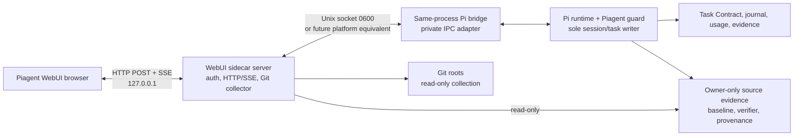

# Piagent WebUI — Master implementation plan

## 1. Decision và mục đích

Tên sản phẩm được chốt là **Piagent WebUI**.

Piagent WebUI là giao diện web local-first để human operator:

- xem Task Contract, criteria, progress, verifier, continuation và usage;
- chat với đúng Pi session hiện tại;
- theo dõi tool activity và approval;
- review ba lớp source change dựa trên Git và task baseline;
- stop, pause và resume task theo lifecycle bền vững;
- hand off việc edit chuyên sâu sang VS Code.

WebUI không thay thế Pi terminal hoặc VS Code. Nó cũng không tạo task database,
agent runtime, model router hoặc source-of-truth mới.

Quyết định release là **contract-first, read-only-first**:

1. `WEBUI-0` khóa schema, evidence, security và same-session feasibility.
2. `WEBUI-1` là read-only product đầu tiên được ship.
3. `WEBUI-2` mới thêm chat, approval và controls.
4. `WEBUI-3` mới thêm source mutation/review actions.
5. `WEBUI-4` mới mở rộng sang long-task và multi-agent projection.

Plan này không hứa zero defect. Nó yêu cầu mọi failure degrade có mô tả, mọi
mutation có authority/audit, và WebUI failure không được kéo Pi runtime xuống.

> **2026-08-14 product amendment:** WEBUI-0 through WEBUI-4 shipped the
> current-session foundation. The approved WEBUI-5 direction adds a local
> Gateway-owned Session Hub, durable multi-session catalog and conversation-first
> conversation shell. See [`40-session-hub-master-plan.md`](40-session-hub-master-plan.md).
> The amendment supersedes the one-active-session/no-daemon product assumption,
> but retains every single-writer, authority, zero-turn and security invariant.

## 2. Product invariants

Các invariant sau là hard gates, không phải visual preference:

1. **Single session owner**: Pi process đang chạy là sole writer của session,
   Task Contract, journal, tool lifecycle, approval và continuation.
2. **No second Pi runtime**: WebUI không spawn `pi --session` thứ hai để đọc hoặc
   ghi cùng session.
3. **Authoritative facts**: Task Contract, journal, Git và observed evidence là
   source of truth. Model prose chỉ là claim.
4. **Zero-view turns**: open, refresh, reconnect, tab switch, diff, activity,
   usage và status tạo `0` provider request.
5. **No prompt pollution**: layout, selected tab/file, collapsed hunk, filter,
   scroll và review UI state không đi vào prompt.
6. **Schema stability**: navigation không thay provider-visible tool schema.
7. **Terminal survival**: WebUI absent, crashed hoặc version-mismatched không
   làm gián đoạn active Pi task.
8. **Git-backed diffs**: diff dựa Git và recorded task baseline, không dựa lời
   model kể đã sửa gì.
9. **Truthful provenance**: task delta không đồng nghĩa agent-authored.
10. **Default deny for authority**: corrupt/stale/identity-mismatched state không
    được dùng cho chat control, approval hoặc mutation.
11. **Explicit confirmation**: destructive và external-provider actions luôn
    cần human confirmation theo repository policy.
12. **No hidden model work**: dashboard status, criterion relation, permission
    decision và commit summary mặc định không gọi utility model.

## 3. Phạm vi sản phẩm

### 3.1 In scope

- Một active Pi session và project scope trong `WEBUI-1`/`WEBUI-2`.
- Task dashboard và Task Contract projection.
- Model/thinking display và lifecycle-valid selection.
- Streaming assistant/tool/approval state.
- Bounded chat transcript và attachments.
- Stop, pause, resume và resume-and-continue.
- Task Changes, Full Working Tree và Staged Changes.
- Read-only inline/split/unified diff.
- Criterion/verifier/provenance links.
- Activity timeline và bounded redacted log preview.
- Usage, context, continuation, handoff và blocker.
- Review/stage/revert actions ở `WEBUI-3`.
- Task history/subagent tree ở `WEBUI-4`.

### 3.2 Explicitly out of scope

- Full code editor, language server, debugger hoặc terminal emulator.
- Internet-facing WebUI, remote tunnel hoặc mobile remote control.
- Multi-user collaboration hoặc shared approval.
- Web-defined tools, plugin marketplace hoặc arbitrary browser JavaScript.
- Agent-generated HTML/widget/iframe.
- Generic provider gateway independent of Pi. WEBUI-5 may supervise Pi SDK
  runtimes through the approved local Session Hub contract.
- Browser-owned agent runtime. WEBUI-5 Gateway-owned Pi runtimes remain allowed.
- Auto-stage, auto-commit, auto-push hoặc automatic pull request.
- One-click discard/revert không preview và confirmation.
- Cloud/background agent environment.
- LLM classifier cho permission hoặc dashboard-only model call.

## 4. Product-fit principles

Plan chọn interaction pattern theo vấn đề và giữ identity trung lập; không clone
visual language, copy, asset hoặc navigation signature của sản phẩm khác.

| Problem | Pattern áp dụng | Điều không áp dụng |
|---|---|---|
| Runtime ownership | Một local Gateway bền vững, typed protocol, reconnect, approval binding | Generic remote gateway, utility-model observer, broad host execution |
| Conversation management | Sidebar hội thoại, search, queue, status, attachment và capability presentation | Model-owned task truth, arbitrary browser plugin, non-durable pause |
| Source review | Git status, Working Tree/Staged, inline/split diff, collapse unchanged, accessible diff | Full IDE/SCM implementation và editor surface |
| Long task review | Plan/review/handoff, attention states và diff khi agent chạy | Cloud agent, auto-run/auto-review và AI-owned change truth |

Mọi pattern phải được chứng minh bằng contract nội bộ, threat model và test của
Piagent. Nguồn bên ngoài không trở thành normative dependency của product.

## 5. Information architecture và UX contract

### 5.1 Desktop layout

```text
┌──────────────────────────────────────────────────────────────────────────────┐
│ Repo / branch │ Pi session │ Task attempt │ Model / Thinking │ Context │ Controls │
├───────────────────────────────┬──────────────────────────────────────────────┤
│ TASK & CHAT                   │ CHANGES │ ACTIVITY │ VERIFICATION            │
│                               │                                              │
│ Task Contract                 │ Task Changes | Full Tree | Staged            │
│ Criteria / progress           │ ┌──────────────┬──────────────────────────┐  │
│ Blocker / next action         │ │ File list    │ Inline / Split diff      │  │
│                               │ │ A M D R U C  │ criterion / verifier     │  │
│ Transcript                    │ │ +lines-lines │ provenance / reviewed    │  │
│ Compact tool summaries        │ └──────────────┴──────────────────────────┘  │
│                               │                                              │
│ Composer / attachments        │ Activity timeline or verifier detail         │
└───────────────────────────────┴──────────────────────────────────────────────┘
```

- Desktop dùng hai pane resizeable.
- Task Contract nằm trên transcript và có thể collapse.
- Right pane có ba primary tabs: Changes, Activity và Verification.
- Active approval nổi trên content và có attention chip trong header.
- User có thể xem diff trong lúc agent chạy mà không ảnh hưởng agent context.

### 5.2 Narrow layout

- Header rút gọn nhưng giữ status, context và attention.
- Task/Chat/Changes/Activity/Verification trở thành top-level tabs.
- Diff mặc định inline; split chỉ hiện khi đủ width.
- Approval mở full-width modal nhưng giữ exact action detail.
- Không đưa mobile remote access vào scope; narrow layout chỉ phục vụ local
  browser window nhỏ.

### 5.3 Header fields

| Field | Source | Behavior |
|---|---|---|
| Repository/branch | Git collector | Copyable; không cho branch mutation trước `WEBUI-3` |
| Pi session | Runtime bridge | Opaque short ref; tooltip có identity detail đã redact |
| Task attempt | Task Contract | Không hiển thị fake task khi chưa có active contract |
| Runtime state | Journal/runtime | Text + icon, không chỉ dùng màu |
| Model/thinking | Pi runtime | Read-only ở `WEBUI-1`; editable khi idle/pre-task ở `WEBUI-2` |
| Permission | Effective guard policy | Hiện effective, không chỉ requested mode |
| Context/token | Usage projection | Unknown là `null`, không tự estimate |
| Continuation | Continuation budget | Used/max và reason nếu exhausted |
| Controls | Runtime control state | Lifecycle-gated và server revalidates |

### 5.4 Canonical state axes

Wire contract không gộp các state có thể đồng thời xảy ra. Nó tách:

- connection: `connected | disconnected | unknown`;
- operation: `idle | running | stopping | settled | unknown`;
- control: `active | pause-requested | paused | terminal | unknown`;
- task outcome: `pending | completed | blocked | partial | failed`;
- verification: `not-run | running | current | stale | failed | unavailable`;
- approval: `none | waiting | resolved | expired | unknown`.

UI có thể chiếu attention label như `waiting-approval`, `pausing`, `verifying`,
`verification-stale`, `recovering` hoặc `ready-for-review`, nhưng không ghi chúng
thành source of truth. `blocker-present` trên task pending khác terminal outcome
`blocked`. State đến từ runtime/journal projection, không từ CSS animation hoặc
tool-supplied `done` flag.

### 5.5 Task criteria presentation

Criterion presentation dùng:

- `pending`
- `in-progress`
- `evidence-present`
- `verified`
- `blocked`
- `unknown`

`verified` chỉ xuất hiện khi evidence contract cho phép. `related by path/hint`
không có nghĩa criterion đã pass.

### 5.6 Empty và degraded states

Mỗi empty state giải thích nguồn dữ liệu:

- “No active Task Contract.”
- “No task changes since the recorded baseline.”
- “No staged changes.”
- “Task baseline content unavailable; names and digests only.”
- “Verifier has not run.”
- “Verifier is stale; invalidating files are unknown for this legacy attempt.”
- “Runtime disconnected; showing last verified snapshot.”
- “State integrity check failed; controls are disabled.”

Không dùng empty spinner vô hạn.

## 6. Control semantics

| Action | Runtime meaning | Task outcome | New agent operation |
|---|---|---|---:|
| Stop | Pi-native abort current agent operation | Task vẫn pending | 0 |
| Pause | Cooperative barrier tại safe point sau atomic tool call | Task vẫn pending | 0 |
| Resume | Validate identity/journal/tree/authority rồi bỏ pause barrier | Không tự chạy model | 0 |
| Resume & continue | Resume rồi gửi một operator-authored message/agent operation | Task tiếp tục | 1 |
| Send chat | Gửi một user message vào current session | Theo message intent | 1 |
| Queue follow-up | Giữ một ordered message cho safe boundary | Chưa tạo operation cho đến khi dispatch | 0 lúc queue |
| Interrupt & send | Abort/steer theo Pi-native semantics rồi dispatch | Không giả pause | 1 |
| Change model/thinking | Set active Pi setting khi idle/pre-task, với effect scope được disclose | Không tạo assistant output | 0 |
| View status/diff/log | Read-only projection | Không đổi task | 0 |

Không dùng `SIGSTOP` hoặc kill process giữa filesystem mutation. Không overload
terminal Task Contract outcome `partial` để biểu diễn `paused`.

Normative terminology, identity, source-of-truth, race/restart và zero-turn
semantics được khóa tại
[`WUI0-01` Product and control contract](decisions/WUI0-01-product-control-contract.md).

Queued messages giữ từng item riêng, có Edit/Delete và stable ordering; không tự
gộp thành một prompt.

## 7. Architecture và ownership



### 7.1 Pi runtime responsibilities

- Session identity và transcript authority.
- Task Contract và criteria/work-plan truth.
- Tool lifecycle và command observations.
- Permission and approval authority.
- Model/thinking setting.
- Stop/pause/resume lifecycle.
- Usage/context và continuation accounting.
- Journal/checkpoint/recovery/handoff.

### 7.2 WebUI sidecar responsibilities

- Serve bundled static assets.
- Authenticate local browser.
- Read normalized runtime snapshot/events.
- Collect Git state an toàn và on demand.
- Build deterministic source/diff projections.
- Stream SSE và bounded replay.
- Forward typed control intent sang Pi runtime.
- Fail soft khi absent/disconnected.

Sidecar không lock/own Task Contract và không mutate project trong `WEBUI-1`.

### 7.3 Browser responsibilities

- Render schemas bằng fixed native components.
- Giữ local visual preferences.
- Gửi typed user intent với idempotency/expected revision.
- Không giữ reusable provider credential.
- Không nhận arbitrary filesystem capability.

## 8. Repository package boundaries

### 8.1 Reusable inspection core

Đề xuất tạo `packages/piagent-core/runtime/inspection/`:

| Module | Responsibility |
|---|---|
| `webui-snapshot.ts` | Assemble canonical snapshot từ existing projections |
| `source-change-projection.ts` | Task/full/staged file projections |
| `git-status-adapter.ts` | Parse porcelain v2 raw status |
| `diff-projection.ts` | Patch/hunk/binary/truncation model |
| `source-evidence-store.ts` | Baseline refs, verifier snapshots, provenance reads |
| `criteria-links.ts` | Deterministic file/criterion/verifier relations |
| `activity-event-adapter.ts` | Normalize legacy/current telemetry |
| `session-control-contract.ts` | Runtime-neutral control types and transitions |
| `approval-broker.ts` | WebUI/TUI approval arbitration ở `WEBUI-2` |

Current [Activity Inspector](../../packages/piagent-core/runtime/product/activity-inspector.ts)
trở thành compatibility formatter trên projector mới. Không duy trì hai cách
tính task/source/activity độc lập.

Existing surfaces được reuse:

- [Task Contract types](../../packages/piagent-core/extensions/guard-types.ts)
- [Task journal](../../packages/piagent-core/extensions/task-journal.js)
- [Resume state](../../packages/piagent-core/runtime/recovery/resume-state.ts)
- [Handoff projection](../../packages/piagent-core/runtime/recovery/handoff-projection.ts)
- [Operator projections](../../packages/piagent-core/runtime/product/operator-projections.ts)
- [Continuation budget](../../packages/piagent-core/runtime/recovery/continuation-budget.ts)
- [Model authorship state](../../packages/piagent-core/runtime/session/model-authorship-state.ts)
- [Task start registration](../../packages/piagent-core/runtime/registration/task-start-tool.ts)

### 8.2 Wire schemas

Tạo `schemas/piagent-webui/`:

- `common-v1.schema.json` — shared definitions, không phải wire payload
- `catalog-v1.json` — build-time local schema registry
- `snapshot-v1.schema.json`
- `runtime-event-v2.schema.json`
- `source-change-v1.schema.json`
- `diff-v1.schema.json`
- `control-command-v1.schema.json`
- `approval-v1.schema.json`
- `capabilities-v1.schema.json`

Schema là public contract giữa runtime, server và browser. Frontend dùng generated
types và không import Node runtime modules.

### 8.3 WebUI package

Tạo private workspace package:

```text
packages/piagent-webui/
├── package.json
├── server/
│   ├── main.ts
│   ├── auth/
│   ├── bridge/
│   ├── git/
│   ├── projections/
│   └── routes/
├── client/
│   └── src/
└── static/
```

Technology baseline:

- React + TypeScript + Vite.
- Node built-in HTTP server.
- Native `EventSource`/SSE cho server-to-browser events.
- HTTP POST cho explicit commands.
- `node:test` cho contract/server/Git/security.
- Playwright Chromium cho E2E.
- Read-only diff renderer; không Monaco ở v1.
- Không CDN hoặc runtime-loaded third-party assets.

### 8.4 Architecture rules

Cập nhật [architecture layers](../../architecture/layers.json) với boundaries:

- `webui-server` có thể depend vào generated contracts, runtime projection và
  security utilities.
- `webui-client` chỉ depend vào generated contracts và browser-safe code.
- `runtime`/`core` không depend vào WebUI package.
- HTTP/frontend code không đi vào Pi composition root.
- Mỗi runtime module giữ line budget hiện hành hoặc có reviewed extraction plan.

### 8.5 CLI và distribution

- Thêm `piagent-webui` entry vào root CLI dispatcher.
- `piagent-webui` launch sidecar, tạo one-time bootstrap và mở local browser.
- WebUI package private trong giai đoạn đầu; static build được đóng gói qua
  reviewed allowlist khi release.
- `governance/piagent-webui/` không nằm trong npm package.
- Không cài service/daemon mặc định trong first release.

## 9. Canonical data contracts

### 9.1 Snapshot envelope

Conceptual TypeScript shape:

```ts
interface PiagentWebUiSnapshotV1 {
  schemaVersion: 1;
  version: "piagent-webui-snapshot-v1";
  generatedAt: string;
  identity: {
    projectRef: string;
    runtimeInstanceId: string;
    sessionRef: string;
    taskId: string | null;
    taskRunId: string | null;
    agentOperationId: string | null;
    toolCallId: string | null;
  };
  revision: {
    runtimeRevision: string;
    taskRevision: string | null;
    controlRevision: string | null;
    workspaceRevision: string | null;
    indexRevision: string | null;
    approvalRevision: string | null;
    journalHead: string | null;
    eventCursor: string;
  };
  capabilities: WebUiCapabilitiesV1;
  session: SessionProjection;
  task: TaskProjection | null;
  sourceChanges: SourceChangeSummary;
  activity: ActivitySummary;
  approvals: ApprovalSummary;
  verification: VerificationProjection;
  usage: UsageProjection;
  continuation: ContinuationProjection;
  handoff: HandoffProjection | null;
  health: HealthProjection;
}
```

Rules:

- Unknown fact là `null` cùng machine-readable `reason` khi cần.
- Snapshot luôn có revision để client phát hiện race.
- Raw filesystem/session paths không trở thành browser capability.
- `health` tách khỏi domain status; không dùng Git status `E`.

### 9.2 File change contract

```ts
interface FileChangeV1 {
  repoRef: string;
  fileRef: string;
  path: string;
  oldPath?: string;
  status: "A" | "M" | "D" | "R" | "U" | "C";
  git: {
    indexStatus: string | null;
    worktreeStatus: string | null;
    conflict: boolean;
  };
  provenance:
    | "pre-existing-user"
    | "runtime-observed-agent"
    | "post-baseline-unattributed"
    | "mixed";
  evidence: "exact" | "derived" | "unavailable";
  additions: number | null;
  deletions: number | null;
  binary: boolean;
  criterionIds: string[];
  verifierAttemptIds: string[];
  health: { state: "ok" | "error"; code?: string };
}
```

### 9.3 Runtime event v2

```ts
interface RuntimeEventV2 {
  schemaVersion: 2;
  eventId: string;
  runtimeInstanceId: string;
  writerSequence: number;
  recordedAt: string;
  projectRef: string;
  sessionRef: string;
  taskId: string | null;
  taskRunId: string | null;
  agentOperationId: string | null;
  toolCallId: string | null;
  revision: {
    runtimeRevision: string;
    taskRevision: string | null;
    controlRevision: string | null;
    workspaceRevision: string | null;
    indexRevision: string | null;
    approvalRevision: string | null;
  };
  kind: RuntimeEventKind;
  correlationId?: string;
  evidence: "observed" | "derived";
  payload: unknown;
  redaction: {
    applied: boolean;
    valuesRemoved: number;
    truncated: boolean;
  };
}
```

Minimum event kinds giữ các state axes riêng:

- `runtime.started|health-changed|disconnected`
- `session.bound|info-changed|compacted|shutdown`
- `agent-operation.started|settled|stop-requested|stop-settled`
- `task.started|state-changed|outcome-changed`
- `task-control.pause-requested|paused|pause-cancelled`
- `task-control.resume-requested|resumed|resume-rejected`
- `task-control.continue-requested|continue-dispatched|continue-uncertain`
- `activity.started|finished|failed|blocked|aborted`
- `approval.requested|resolved|expired`
- `source.changed`
- `verifier.started|finished|stale`
- `usage.updated`
- `handoff.updated`
- `runtime.health-changed`

Event stream phục vụ live view/reconciliation; nó không thay journal hoặc Task
Contract.

### 9.4 Capability handshake

Handshake công bố:

- `protocolMin` và `protocolMax`;
- supported snapshot/event versions;
- `inspect`, `control.chat`, `control.lifecycle`, `control.sessionOptions`,
  `attachments`, `approve`, `reviewActions`;
- active session/task refs;
- runtime/server build identity;
- replay retention và limits.

Unknown required version disable control và giải thích mismatch; read-only có thể
degrade khi schema compatibility cho phép.

## 10. Source Changes contract

### 10.1 Three independent views

| View | Baseline | Current side | Includes |
|---|---|---|---|
| Task Changes | Recorded task-start working tree | Current working tree | Mọi thay đổi từ task baseline, bất kể author |
| Full Working Tree | HEAD | Index + working tree + untracked | Pre-existing và current workspace changes |
| Staged Changes | HEAD | Index | Chỉ nội dung chuẩn bị commit |

Không lấy một diff rồi đổi label. Mỗi view có independent revision và failure
state.

### 10.2 Git collection safety

Collector dùng process argv, không shell string:

- `git --no-optional-locks`
- `GIT_OPTIONAL_LOCKS=0`
- porcelain v2 `-z`
- `--no-ext-diff`
- `--no-textconv`
- no pager
- path arguments sau `--`
- sanitized environment
- không recurse submodule mặc định

Mở WebUI không chạy hook, external diff hoặc textconv. Diff được load lazy khi
user chọn file và có byte/line/time caps.

### 10.3 Status presentation

Canonical display status:

- `A` — added
- `M` — modified
- `D` — deleted
- `R` — renamed
- `U` — untracked
- `C` — conflict

Raw index/worktree codes vẫn lưu riêng. Error dùng `health`, không dùng `E` làm
Git status.

### 10.4 Diff behavior

- Side-by-side mặc định khi viewport đủ rộng.
- Inline toggle.
- Unified accessible view.
- Added lines xanh + textual `+` marker.
- Deleted lines đỏ + textual `-` marker.
- Collapse unchanged với “N unmodified lines”.
- Next/previous hunk keyboard navigation.
- `+N/-N` stats.
- Copy path và copy hunk.
- Open in VS Code khi capability sẵn có.
- Binary/symlink/submodule/oversized file có explicit fallback.
- Stale digest trả `stale-retry`, không render patch dưới revision sai.

### 10.5 Reviewed state

`WEBUI-3` lưu review acknowledgement theo:

```text
{ repoRef, path, baseDigest, currentDigest, view }
```

File đổi digest thì reviewed state tự stale. “Accept” chỉ là review
acknowledgement; không đồng nghĩa stage hoặc commit.

## 11. Task baseline, verifier và provenance evidence

### 11.1 Current gap

Task start hiện giữ digest map nhưng không giữ đủ baseline bytes cho file đã
dirty/untracked/deleted. Vì vậy exact task-only hunk không thể được dựng trung
thực chỉ từ current hashes.

### 11.2 Source evidence layout

Đề xuất owner-only local state:

```text
.pi/piagent-state/source-evidence/<taskRunId>/
├── manifest.json
└── blobs/<sha256>
```

Manifest bind:

- task attempt ID (`taskRunId`);
- hashed session identity;
- Git root/project ref;
- HEAD OID nếu có;
- task baseline tree digest;
- protected/oversized/unavailable reasons;
- content refs và integrity digest;
- created/retention metadata.

Rules:

- Clean tracked file dùng recorded HEAD blob; không duplicate content.
- Dirty/untracked/deleted/symlink file dùng bounded private baseline ref.
- Protected hoặc oversized content không lưu raw bytes.
- Không dùng `git hash-object -w` cho dirty baseline.
- Directory `0700`, files `0600`, atomic rename và no-symlink writes.
- Quota exhaustion degrade rõ; không silent deletion.
- Content refs không được inject vào prompt.
- Legacy task hiện `names-and-digests-only`.

### 11.3 Provenance ledger

Persist sau successful mutation:

- runtime/session/task/tool correlation;
- before/after file digests;
- observed direct paths;
- evidence mode;
- recorded timestamp.

Rules:

- File dirty ở baseline rồi agent chạm tiếp là `mixed`.
- File đổi sau baseline nhưng không có exact mutation evidence là
  `post-baseline-unattributed`.
- Shell side effect không tự được claim agent-authored nếu path/digest evidence
  không đủ.
- File-level provenance ship ở `WEBUI-1`; hunk-level provenance chỉ ở
  `WEBUI-3` khi preimage proof đủ.

### 11.4 Verifier snapshots

Mỗi verifier attempt lưu:

- attempt ID;
- canonical argv và CWD đã redact;
- command digest;
- start/end/duration;
- exit code và outcome;
- tree digest;
- bounded per-file digest snapshot/ref;
- criterion relation nếu explicit;
- log preview ref.

Current digest map được so với verify-time map để sinh
`invalidatedByFiles`. Legacy attempt không có map hiển thị stale với files
unknown; không đoán.

### 11.5 Criterion linking

Allowed relation sources:

- Task Contract target hints;
- explicit scoped paths;
- verifier/evidence declaration;
- deterministic file patterns đã version hóa.

UI label là `related by path`, `related by target hint` hoặc `explicit evidence`.
Relation không tự chuyển criterion sang verified.

## 12. Activity và verifier UX

### 12.1 Activity card fields

- Tool name và kind.
- `running`, `passed`, `failed`, `blocked`, `cancelled`, `interrupted`.
- Canonical command/arguments đã redact.
- CWD/project ref.
- Start, end và duration.
- Exit code khi có.
- Bounded preview.
- Related file/criterion/verifier refs.
- Truncation/redaction indicators.

Chat chỉ hiện compact rows. Activity tab giữ timeline/filter. Consecutive similar
calls có thể group presentation nhưng evidence vẫn giữ từng event.

### 12.2 Log contract

- Không dump full log vào chat.
- Preview dùng existing redaction trước persistence.
- Hard cap theo bytes/lines.
- Strip ANSI/control characters khi render.
- Full raw path không đi qua browser.
- Missing/corrupt preview không block task projection.

### 12.3 Verification panel

Hiện:

- Latest exact verifier.
- Outcome và exit code.
- Tree digest rút gọn/copyable.
- Fresh/stale/unknown state.
- Invalidating files.
- Related criteria.
- Why task cannot complete.
- Last verified time và current revision.

## 13. Chat, model và attachments

### 13.1 Same-session chat

`WEBUI-2` dùng same-process bridge đã proof ở `WUI0-11`. Bridge gọi Pi-native
send/abort/model/thinking surfaces trong process đang sở hữu session.

Không có compatibility fallback bằng cách khởi động Pi khác.

### 13.2 Transcript

- Load bounded recent window.
- Older history lazy-load theo cursor nếu runtime hỗ trợ.
- Assistant deltas stream theo stable `messageId`/`agentOperationId`.
- Tool cards không expand toàn bộ mặc định.
- Reconnect reconcile theo ID/sequence.
- Duplicate event/message được dedupe.

### 13.3 Composer và queue

- Send khi idle tạo đúng một user message/agent operation.
- Khi running, default action là Queue follow-up.
- Separate action cho Interrupt & send.
- Queue item có Edit/Delete và order.
- Attachments hiện size/type/root state trước send.
- UI ghi rõ action nào tạo model work.

### 13.4 Model/thinking

- Catalog lấy từ authenticated Pi runtime view.
- Chọn trước task mới hoặc khi session idle.
- Runtime revalidate lifecycle dù UI disable control.
- Active task không silent switch model/thinking giữa turn.
- Selected value là active Pi runtime setting, không tạo prompt-only override.
- Handshake phải công bố effect scope `session` hoặc
  `session-and-user-default`; Pi `0.84.1` không được mô tả sai là session-only.

### 13.5 Attachments

- File/image only trong first iteration.
- Owner-only temp storage.
- Size, MIME, count và total-byte limits.
- Canonicalize selected source roots.
- Không auto-open, auto-execute hoặc expand archive.
- Attachment reference bind message/session và expiry.
- Cleanup bounded; không delete user source file.

## 14. Permission và approval

### 14.1 Capability split

- `inspect`: snapshots, Git/diff, activity, usage.
- `control.chat`: explicit message và runtime-owned held-queue dispatch.
- `control.lifecycle`: stop, pause và control-resume.
- `control.sessionOptions`: lifecycle-valid model/thinking setting.
- `attachments`: bounded staging cho một explicit chat dispatch.
- `approve`: resolve active Pi guard request.
- `reviewActions`: stage/unstage/revert ở `WEBUI-3`.

`WEBUI-1` chỉ expose `inspect`.

### 14.2 Approval card

Card phải hiện:

- exact tool/action;
- canonical command/parameters;
- CWD;
- target paths/provider/URL;
- requested scope;
- reason và risk class;
- expiry;
- task/session/tool-call identity rút gọn;
- consequences của allow/deny.

### 14.3 Approval binding

One-time approval nonce bind:

- project ref;
- runtime instance ID;
- opaque session ref ở browser, resolved và exact-match raw session ID trong
  trusted runtime;
- task ID;
- task attempt ID (`taskRunId`);
- agent operation ID;
- tool call ID;
- exact action digest;
- expected runtime, task và approval revisions;
- expected workspace revision/preimage khi action phụ thuộc current tree;
- expiry;
- decision ID.

Terminal và WebUI có thể cùng nhận request. First valid compare-and-swap response
wins. Replay, stale, mismatch hoặc expired response bị reject và audit.

Browser chỉ trả decision cho Pi guard; nó không thực thi action. Browser
disconnect không tự tạo allow/deny. Chỉ runtime-native expiry mới có thể ghi
`expired` và áp dụng default-deny/fallback đã định nghĩa; không bao giờ auto-allow.

Nếu user chỉnh command/target trong UI, đó là action mới, cần guard evaluation và
approval digest mới.

## 15. Local transport và API

### 15.1 Transport choice

- Browser ↔ sidecar: HTTP + SSE.
- Sidecar ↔ Pi bridge: private Unix socket `0600`; future Windows equivalent cần
  separate platform design.
- SSE đủ cho `WEBUI-1`; không cần WebSocket trước khi bidirectional bridge thật
  sự yêu cầu.

### 15.2 Read-only routes

```text
GET /api/v1/capabilities
GET /api/v1/snapshot
GET /api/v1/source-changes?view=task|working-tree|staged
GET /api/v1/diffs/:diffRef
GET /api/v1/activity
GET /api/v1/log-previews/:activityRef
GET /api/v1/events?after=<cursor>
```

Không có mutation route trong `WEBUI-1`.

### 15.3 Control routes

```text
POST /api/v1/chat/messages
POST /api/v1/control/stop
POST /api/v1/control/pause
POST /api/v1/control/resume
POST /api/v1/control/resume-and-continue
POST /api/v1/approvals/:approvalRef/decision
POST /api/v1/attachments
```

Mọi POST yêu cầu:

- authenticated session cookie;
- CSRF token;
- capability scope;
- idempotency key;
- expected revision;
- active session/task binding;
- bounded body;
- audit result.

### 15.4 Reconnect protocol

1. Client lấy authoritative snapshot kèm cursor.
2. Client subscribe SSE từ cursor.
3. Server replay bounded missed events.
4. Client reconcile bằng event/message/approval IDs.
5. Nếu cursor ngoài retention, server gửi `resync-required`.
6. Client lấy snapshot mới.
7. Client không dựng `running` từ browser cache.

## 16. Local Web security contract

### 16.1 Network boundary

- Bind chính xác `127.0.0.1` và random port.
- V1 không có `--host`, LAN bind hoặc remote access.
- Exact Host và Origin allowlist chống DNS rebinding.
- Không `Access-Control-Allow-Origin: *`.

### 16.2 Browser bootstrap

- Generate 256-bit capability mỗi launch.
- Launch URL giữ capability trong fragment, không query/log/referrer.
- One-time exchange tạo HttpOnly, Secure-when-applicable,
  `SameSite=Strict` cookie.
- Bootstrap capability invalid sau exchange/expiry.
- Server restart invalid pending browser control capability.

### 16.3 Content security

- CSP `default-src 'self'` với minimal explicit directives.
- `object-src 'none'`, `base-uri 'none'`, `frame-ancestors 'none'`.
- Không remote images/fonts/scripts/styles, analytics hoặc service worker.
- Không `eval` hoặc inline executable content.
- Không iframe/model-generated HTML.
- Repo text, filename, diff, tool output và log là hostile content.
- Render text-only, escape markup, strip ANSI/control characters.

### 16.4 Filesystem boundary

- Browser dùng opaque refs, không gửi arbitrary absolute path.
- Server canonicalize dưới fixed project/Git roots.
- Realpath/symlink escape fail closed.
- Protected-path policy áp dụng cho raw content và diff.
- Không expose raw session JSONL, state-store path, approval store hoặc log path.

### 16.5 Resource limits

- Body size/count/time limits.
- Diff and log hard caps.
- Rate limit auth/control/approval routes.
- Request cancellation và server timeouts.
- Git process concurrency cap.
- No external diff/textconv/hook execution.

### 16.6 Threat priorities

| Threat | Severity | Required mitigation |
|---|---|---|
| Unauthenticated/non-loopback access | Critical | Loopback-only, bootstrap auth, Host/Origin checks |
| XSS approval takeover | Critical | Fixed components, CSP, hostile-text rendering |
| Second session writer | Critical | Same-process bridge gate; no fallback runtime |
| Action endpoint bypasses guard | Critical | Pi guard sole executor; typed intent only |
| Session/task identity mixup | Critical | Bind every request/event to exact project/runtime/session/task/agent-operation identity |
| Arbitrary/protected file read | High | Opaque refs, root/protected-path checks |
| Approval replay/race | High | One-time CAS nonce, expiry, exact action digest |
| Git external execution | High | `--no-ext-diff`, `--no-textconv`, sanitized argv/env |
| Baseline secret retention | High | Private bounded store, exclusions, retention, no Git objects |
| Diff/log denial of service | Medium | Lazy load, caps, timeouts, coalescing |
| False provenance/verifier claim | High | Evidence modes, unknown state, digest binding |

## 17. Zero-model-turn và performance contracts

### 17.1 Zero-model-turn acceptance

Với open, refresh, reconnect, tab switch, diff, log, status, pause-state view và
unpause, causal attribution phải chứng minh:

- không có provider request do UI action tạo;
- không có user/assistant message hoặc token/cost do UI action tạo;
- không có `continuation-consumed` event;
- provider-visible tool-schema digest không đổi;
- không có UI state trong prompt;
- Inspector JSON và HTTP snapshot canonical deep-equal trên cùng fact bundle sau
  khi bỏ declared transport metadata như `generatedAt`, cursor delivery và HTTP
  cache field.

Test quiescent còn yêu cầu global counters bất biến. Test concurrent cho phép
active operation độc lập settle usage, nhưng không được có event/correlation path
từ UI action đến provider/message/continuation.

`Send chat`, `Resume & continue` và optional model-generated commit summary phải
được label trước action là tạo model work. Một accepted message tạo đúng một
agent operation nhưng operation có thể có nhiều turn/provider request qua tool
loop.

### 17.2 Collection strategy

- Event-driven invalidation từ existing hooks.
- Debounce/coalesce filesystem churn.
- Initial snapshot + invalidation, không constant full-tree hashing trong Pi
  event loop.
- Heavy Git work ở sidecar.
- Không poll khi browser tab hidden.
- Fallback lightweight status polling chỉ khi visible và thiếu event source.
- Diff cache key gồm baseline/current/index digest và path.

### 17.3 Initial measurable budgets

Các số sau là engineering targets, phải rebaseline trong `WEBUI-0` trước khi
trở thành release claim:

| Metric | Initial target |
|---|---:|
| Idle WebUI CPU | `<1%` average |
| Cached/observed snapshot p95 | `<250 ms` |
| Exact source snapshot p95 | `<1 s` trên repo 10k files/1k changed |
| Small-file diff p95 | `<300 ms` |
| Sidecar RSS | `<150 MB` |
| File-churn coalesce | `100–250 ms` |
| Read-only model calls | `0` |

Không pass gate bằng cách bỏ correctness hoặc evidence fields để đạt latency.

`WUI1-10` calibrates the first release against the complete audited projector,
including protected-path checks, two-phase Git race detection and TypeScript
runtime loading. The release budgets are `<250 ms` cached snapshot, `<1.25 s`
exact source on the 10k/1k fixture, `<300 ms` small diff and `<200 MB` sidecar
RSS. The original table remains the optimization target; the release gate does
not remove correctness or evidence fields to reach it.

## 18. Delivery plan

### 18.1 Milestone summary

| Milestone | Outcome | Estimate |
|---|---|---:|
| `WEBUI-0` Contract | Versioned truth/evidence/security/control foundation | 15–22 engineer-days |
| `WEBUI-1` Read-only WebUI | First shippable local dashboard | 20–28 engineer-days |
| `WEBUI-2` Chat & Control | Minimum complete operational product | 28–42 engineer-days |
| `WEBUI-3` Review Actions | Guarded review/stage/revert workflow | 18–28 engineer-days |
| `WEBUI-4` Long-task Dashboard | Durable task/timeline/handoff/agent views | 15–22 engineer-days |

### 18.2 WEBUI-0 — Contract

#### Deliverables

- Product invariant ADR và terminology.
- Stop/pause/resume state transition contract.
- Snapshot/event/source/diff/control/approval schemas.
- Safe porcelain-v2 Git collector.
- Canonical three-view source projection.
- Task Baseline Manifest và content refs.
- Persisted mutation provenance.
- Verifier per-file snapshot.
- Criteria/file/verifier projection.
- Runtime event cursor/replay/resync.
- Local WebUI threat model.
- Zero-model-turn conformance harness.
- Same-process/current-session bridge spike.

#### Required fixtures

- A/M/D/R/U/C.
- Rename + edit.
- Staged, unstaged và mixed index/worktree.
- Binary, symlink, submodule và oversized file.
- Spaces, Unicode và newline trong filename.
- Unborn HEAD, detached HEAD và no-Git workspace.
- Nested/multiple Git roots.
- Pre-existing dirty → agent mutation.
- Agent mutation → baseline restore.
- Concurrent human edit và Git race.

#### Exit gate

- Exact task patch hoặc explicit unavailable reason.
- No false `runtime-observed-agent` claim.
- Baseline capture không đổi Git index/worktree/object store.
- Inspector and WebUI normalized snapshots deep-equal.
- Security paths fail closed.
- Read-only harness chứng minh zero model turns.
- Test message proof đi vào đúng running Pi process/session.
- Bridge proof thất bại thì `WEBUI-2` blocked, không spawn second Pi.

#### Rollback

- Inspector v1 wrapper vẫn hoạt động.
- New evidence sidecars không cần để legacy runtime đọc.
- Feature flags giữ WebUI off.

### 18.3 WEBUI-1 — Read-only WebUI

#### Deliverables

- Private WebUI workspace package và build.
- `piagent-webui` local launcher.
- Loopback authentication và CSP.
- Read-only API + SSE.
- Task/session header.
- Criteria/progress/blocker/next-action dashboard.
- Three Source Changes tabs.
- File list/status/stats/provenance/relations.
- Inline/split/unified diff.
- Activity timeline và bounded log previews.
- Latest verifier, tree digest và stale files.
- Usage/context/continuation/handoff.
- Responsive, keyboard và accessible behavior.
- Offline/disconnected/corrupt/partial states.

#### Exit gate

- Open 10 phút không tạo provider call.
- Browser/server restart không đổi task/session.
- Kill sidecar giữa tool call: Pi task hoàn tất bình thường.
- Git views match fixtures and direct Git evidence.
- Binary/large/protected content degrade rõ ràng.
- No mutation route tồn tại.
- Security, accessibility, E2E và performance gates pass.
- Terminal Inspector vẫn dùng được khi WebUI absent.

#### Ship decision

Đây là first product milestone được ship, opt-in và read-only.

### 18.4 WEBUI-2 — Chat & Control

#### Deliverables

- Production same-session bridge.
- Bounded transcript và assistant/tool streaming.
- Composer và ordered follow-up queue.
- Interrupt & send semantics.
- Model/thinking picker.
- File/image attachments.
- Approval broker và card.
- Journal-backed stop/pause/resume state.
- Control UI và attention states.
- Idempotency/dedup/reconnect.

#### Exit gate

- One Send → exactly one user message/agent operation; operation có thể có nhiều
  turn/provider request.
- Message xuất hiện đúng current session/agent operation.
- Refresh/retry không duplicate.
- Cancelled/failed session replacement revalidates and safely reopens the
  unchanged session, or leaves control explicitly `resync-required`.
- Stop aborts agent operation nhưng không terminalize Task Contract.
- Pause survives restart và blocks new model/mutation work.
- Resume validates journal/session/tree/authority.
- Resume-versus-pause-worker race proves no delayed abort/paused append can hit a
  new operation after cancellation acknowledgement.
- Resume & continue tạo đúng một operator-authored message/agent operation.
- Terminal/WebUI approval race có một winner và audit.
- Pause/approval/tool-start share one runtime linearization point and both race
  orderings pass.
- Refresh/disconnect không auto-resolve approval.
- Attachment roots/limits/protection pass.
- No second session writer.

#### Rollback

- Disable `control`; WebUI quay về read-only.
- Terminal chat/control/approval tiếp tục là fallback authority surface.

### 18.5 WEBUI-3 — Review Actions

#### Deliverables

- Digest-bound reviewed state.
- Stage/unstage file.
- Hunk preimage/CAS engine.
- Stage/unstage hunk sau khi proven safe.
- Reject/revert preview và confirmation.
- Open in VS Code.
- Deterministic commit summary.
- Optional explicit model-generated summary có usage label.
- Audit trail và verifier/review invalidation.

#### Semantics

- Accept = review acknowledgement, không stage.
- Stage/unstage là action riêng.
- Reject/revert cần current preimage digest.
- Mixed/unattributed hunk không auto-reject.
- Không dùng broad `git checkout`/`reset` cho convenience.
- Không auto-commit/push.

#### Exit gate

- Every mutation has preview, expected revision, before/after digest and audit.
- Stale preview rejects without mutation.
- Concurrent human edit preserved.
- Conflict and mixed provenance fail closed.
- Any content mutation invalidates relevant verifier/review state.
- No one-click destructive action.

### 18.6 WEBUI-4 — Long-task Dashboard

#### Deliverables

- Active/recent task and attempt list.
- Crash/resume/pause/checkpoint timeline.
- Compaction/recovery history.
- Handoff history và next action.
- Subagent tree, ownership và stale-result state.
- Local benchmark/release monitoring.
- Retention/integrity warnings.

#### Exit gate

- Views rebuild từ persisted authoritative facts.
- Corrupt/missing gaps hiện unknown/warning, không tự lấp bằng model summary.
- Correct project/session/task/run identities trong mọi row.
- Bounded history và scale tests pass.
- Filtering/search không tạo model call.
- Không remote orchestration hoặc multi-user authority.

## 19. Test strategy

### 19.1 Contract/core

- JSON Schema golden and compatibility tests.
- Negotiated current schemas reject unknown fields; unknown or unnegotiated
  required versions reject authority, và compatible inspect chỉ degrade qua
  explicit capability handshake.
- Deterministic projector: same inputs → byte-equivalent normalized JSON.
- Inspector v1 compatibility wrapper.
- Legacy telemetry adapter.
- Corrupt/truncated JSONL fail-soft for inspection.
- State corruption fail-closed for controls.

### 19.2 Git and diff

- Full matrix trong `WEBUI-0` fixtures.
- Status/diff read races.
- Index changes giữa request và apply.
- Binary and large-file caps.
- Symlink/project escape.
- Protected-path no-content behavior.
- External diff/textconv disabled.
- Nested/multi-root ordering stable.

### 19.3 Security

- DNS rebinding và Host spoof.
- Origin/CORS/CSRF/cookie/bootstrap expiry.
- Capability replay.
- Malformed/oversized body.
- XSS payloads trong filenames, diff, logs và tool args.
- ANSI/control stripping.
- Path traversal/symlink escape.
- Approval action digest mismatch.
- Concurrent terminal/WebUI approval.
- Concurrent Pause/approval/tool-start in both orderings.
- Generic shell/path endpoint absence.
- No external asset/network request.

### 19.4 Failure isolation

- Kill/restart browser.
- Kill/restart sidecar.
- Break private IPC.
- Restart sidecar during approval.
- Restart Pi runtime during approval; old request is cancelled/expired and cannot
  resolve or execute in the new runtime.
- Resume cancels a delayed pause worker before a new dispatch without later abort.
- Disk full/corrupt baseline.
- Missing verifier snapshot.
- Event cursor beyond retention.
- Runtime/server protocol mismatch.
- Session replacement cancelled/failed after bridge gate closes and before
  teardown.
- Pi runtime runs normally with WebUI package absent.

### 19.5 E2E UX states

- No active task.
- Active running task.
- Waiting approval.
- Pausing/paused/resuming.
- Blocked task.
- Fresh/stale/unknown verifier.
- Dirty baseline.
- Conflict/binary/large file.
- Disconnected/corrupt/partial data.
- Keyboard-only and screen-reader diff path.

### 19.6 Existing repository gates

Milestone completion chạy:

```bash
npm test
npm run typecheck
npm run architecture:check
npm run docs:check
npm run capabilities:check
npm run verify -- --offline
```

Thêm WebUI build, contract, Playwright, security, performance và package dry-run
commands khi các scripts được tạo.

## 20. Migration, compatibility và rollout

### 20.1 Compatibility

- Giữ `/piagent-inspector` và footer ít nhất hai minor releases.
- Refactor Inspector sang shared projector nhưng adapter output v1 vẫn tồn tại.
- Reader hỗ trợ telemetry v1 và runtime-event v2; không rewrite history.
- Source evidence bắt đầu cho task mới.
- Legacy task báo missing capability, không giả task hunk/provenance.
- Server/bridge negotiate protocol range và capabilities.

### 20.2 Rollout sequence

1. Release A: contracts/evidence/test harness, WebUI off.
2. Release B: read-only `piagent-webui` opt-in.
3. Release C: `WEBUI-1` stable; controls vẫn off.
4. Release D: chat/control opt-in theo local profile.
5. Release E: review actions opt-in.
6. Chỉ cân nhắc read-only default-on sau soak/fault gates.

Không tự migrate hoặc delete credentials, sessions, journals hoặc source evidence.

### 20.3 Feature flags

Flags conceptual:

- `webUi.enabled`
- `webUi.readOnly`
- `webUi.control`
- `webUi.approvals`
- `webUi.reviewActions`

Exact config location/schema được chốt ở `WEBUI-0`; default ban đầu là off hoặc
read-only opt-in.

## 21. Delivery organization và estimates

Base estimate:

- `WEBUI-0 + WEBUI-1`: 35–50 engineer-days.
- Qua `WEBUI-2`: 63–92 engineer-days.
- Toàn roadmap: 96–142 engineer-days.
- Planning budget với integration contingency: 110–160 engineer-days.

Với hai engineers có kinh nghiệm:

- Runtime/backend owner: schemas, Git/evidence, Pi bridge, controls, security.
- Frontend/product owner: WebUI server/client, UX, diff, accessibility, E2E.
- Shared: contract review, failure injection và release gates.

Estimated calendar:

- Read-only first ship: 5–7 tuần.
- Chat/control product: 10–15 tuần.
- Full roadmap: 16–24 tuần.

Critical path:

```text
Contracts
→ Git baseline/evidence
→ Read-only WebUI
→ Proven same-session bridge
→ Chat/control
→ Safe review actions
→ Long-task index
```

Rebaseline `WUI0-11` ngày 2026-08-13 cộng 8–12 engineer-days vào `WEBUI-2` cho
lifecycle arbiter và approval broker vì Pi `0.84.1` chỉ chứng minh được
same-process Chat/stream/model-thinking; semantic Pause, acknowledged Stop và
approval injection chưa có. Upstream Pi change chưa được commit không được tính
như công việc miễn phí. Rebaseline tiếp theo diễn ra tại `WEBUI-1` ship gate
hoặc khi host contract thay đổi.

## 22. Risk register

| Risk | Severity | Mitigation | Hard decision |
|---|---|---|---|
| Không attach đúng Pi process/session | Critical | Early bridge spike, exact identity test | Block `WEBUI-2`; no second runtime |
| Web approval mở privilege path | Critical | Guard sole executor, nonce/expiry/CAS | Control remains off until audit passes |
| WebUI crash ảnh hưởng terminal | Critical | Separate sidecar, fail-soft bridge | Cannot ship if fault injection fails |
| Baseline giữ sensitive content | High | Protected exclusions, private bounded store | Raw protected content unavailable |
| Git race trả sai diff | High | Revision digest, retry/partial response | Never render mismatched patch |
| False agent authorship | High | Before/after evidence, mixed/unattributed | Task delta is not authorship |
| Verifier stale files sai | High | Verify-time digest map | Unknown rather than inferred |
| Frontend XSS | Critical | Fixed components, CSP, hostile text tests | No model/tool HTML or iframe |
| Diff/log resource exhaustion | Medium | Lazy load, caps, process limits | Stats-only fallback |
| Schema drift | Medium | Generated types, version negotiation | Controls disabled on mismatch |
| Frontend dependency supply chain | Medium | Minimal pinned dependencies, no CDN | Review package additions |
| Estimate expansion from Pi host gaps | High | `WUI0-11` early spike | Rebaseline before `WEBUI-2` |

## 23. Definition of Done

Toàn bộ program chỉ `complete` khi:

- WebUI connects to đúng Pi session without second writer.
- Read-only use demonstrably creates zero provider turns.
- Task, source, verifier, usage và handoff projections are deterministic.
- Three Source Changes views are exact or truthfully unavailable.
- Provenance never overclaims agent authorship.
- Stop/pause/resume survive restart with documented semantics.
- Approval is exact-action-bound, one-time and default-deny.
- Every mutation in review actions has preview/digest/audit/confirmation policy.
- WebUI can crash without changing active Pi execution.
- Security, accessibility, performance, Git and failure matrices pass.
- Terminal Inspector remains operational.
- Rollback to read-only/disabled WebUI is tested.
- No scope-excluded feature was silently introduced.

## 24. Bootstrap sequence

Đầu tiên chọn `WUI0-01`, ghi owner/session trong [`STATUS.md`](STATUS.md), sau đó
tạo ADR khóa:

- product/session/task terminology;
- source-of-truth hierarchy;
- exact Stop/Pause/Resume transitions;
- inspect/control/approve capability boundaries;
- zero-model-turn conformance definition.

Sau khi ADR được accept và verify, chọn `WUI0-02` để khóa wire schemas, revision,
idempotency và degraded-state contract. Không scaffold frontend trước khi
`WUI0-02` schema direction và `WUI0-11` same-session feasibility có proof tương
ứng. Current action luôn lấy từ [`STATUS.md`](STATUS.md), không suy từ section này.
