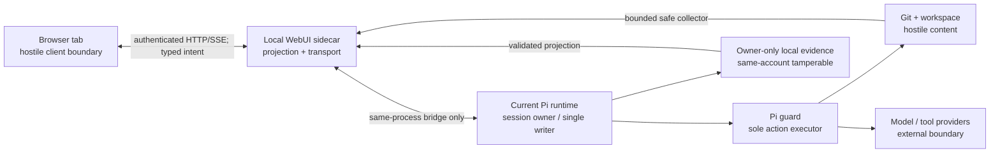
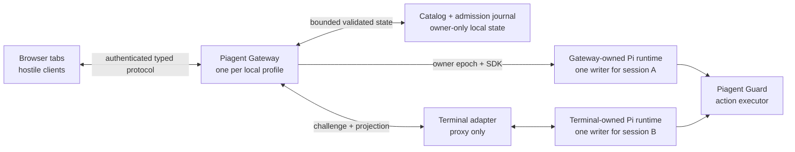

# Piagent WebUI local security threat model

## 1. Phạm vi và kết luận

WebUI chạy local nhưng không được xem là cùng trust zone với Pi runtime. Một
trang web khác, extension trình duyệt, tab cũ, nội dung repo, filename, diff,
tool output, log và Git config đều có thể là đầu vào thù địch. Pi runtime vẫn là
single writer; Pi guard vẫn là sole executor. Browser chỉ nhận projection và
gửi typed intent.

Threat model này áp dụng cho `WEBUI-0` đến `WEBUI-5`, bao gồm static bundle,
loopback sidecar, bridge vào Pi, local evidence, Git collector, snapshot/event
transport, Chat/Control, approval và review actions. Contract máy đọc được nằm
tại [`security-contract.v1.json`](security-contract.v1.json). File JSON khóa ID,
severity, control ownership và fault-injection gate; tài liệu này khóa rationale
và cách áp dụng.

Đây là application security boundary, không phải OS sandbox. Repo đã được trust
có thể thực thi code bằng dependency, binary hoặc process ngoài đường tool mà
WebUI quan sát. Với repo thực sự không tin cậy, operator vẫn cần container/VM,
filesystem/network isolation và credential separation.

## 2. Kiến trúc tin cậy



Các boundary canonical:

| ID | Boundary | Quy tắc |
|---|---|---|
| `B-BROWSER` | Browser ↔ loopback sidecar | Hostile client; auth, Origin, CSRF, bounds bắt buộc |
| `B-REPO` | Repo/Git ↔ collector/renderer | Mọi text và config là hostile content |
| `B-SIDECAR` | Sidecar ↔ Pi bridge | Adapter không authority; không sở hữu session/task |
| `B-GUARD` | Typed intent ↔ action execution | Authority transition duy nhất qua Pi guard |
| `B-STATE` | Local state ↔ projector | Owner-only nhưng process cùng account vẫn có thể sửa |
| `B-SUPPLY` | Dependencies ↔ browser bundle | Chỉ local, pinned, reviewed, không runtime loader |

## 3. Tài sản cần bảo vệ

| ID | Tài sản | Failure quan trọng nhất |
|---|---|---|
| `A-SESSION` | Pi session, transcript, queue | lộ dữ liệu hoặc gửi vào sai session |
| `A-CONTROL` | Task journal, control revision, dispatch | stop/pause/resume sai operation hoặc second writer |
| `A-APPROVAL` | Approval nonce, decision, precondition | replay, XSS takeover hoặc action substitution |
| `A-SOURCE` | Source, protected paths, Git index | arbitrary read/write, stage/revert ngoài scope |
| `A-EVIDENCE` | Baseline, provenance, verifier, handoff | giả completion/attribution hoặc giữ secret |
| `A-SECRETS` | Credentials và sensitive outputs | xuất hiện trong UI, event, URL hoặc log |
| `A-AVAILABILITY` | Pi terminal và local resources | WebUI làm chậm/ngắt task đang chạy |
| `A-SUPPLY` | Bundle và dependency integrity | third-party script có browser authority |
| `A-ATTACHMENT` | Staged browser-selected bytes và one-shot refs | leak, cross-session send hoặc resource exhaustion |
| `A-REVIEW` | Digest-bound selected-file review acknowledgements | stale/cross-view acknowledgement overclaims source đã được operator xem |

## 4. Source of truth và authority

Thứ tự authority không thay đổi theo màn hình:

1. Đúng một Pi runtime sở hữu mỗi session trong một owner epoch; runtime đó có
   thể do terminal hoặc Gateway sở hữu nhưng không bao giờ đồng thời cả hai.
2. Pi guard quyết định và thực thi tool/action; sidecar không được chạy mutation
   thay guard.
3. Git, Task Baseline Manifest, provenance ledger, verifier snapshots và Task
   Contract cung cấp source/evidence truth.
4. Canonical snapshot và runtime events là deterministic projections.
5. Browser cache là hint hiển thị, không chứng minh `running`, approval, verifier
   hoặc completion.

Unknown/missing/corrupt evidence phải ra `unknown`, `unavailable`, `mixed`,
`unattributed` hoặc `resync-required`. Không fallback sang lời model kể. Không
được mở Chat/Control bằng cách chạy `pi --session` hoặc tạo SDK/RPC runtime thứ
hai cho một session đã có owner. Gateway chỉ được tạo SDK runtime sau khi atomic
owner admission chứng minh session chưa có writer. Nếu terminal bridge hoặc
Gateway lease không đủ capability, action liên quan ở trạng thái unavailable.

## 5. Network và bootstrap contract

`C-NET-LOOPBACK` bắt server bind đúng `127.0.0.1` trên port ngẫu nhiên. V1 không
có `--host`, `0.0.0.0`, IPv6 wildcard, LAN bind hay remote tunnel. Test phải xác
nhận socket thực tế, không chỉ inspect config.

`C-NET-ORIGIN` bắt exact `Host` và `Origin` allowlist để chống DNS rebinding và
host confusion. Không phát `Access-Control-Allow-Origin: *`; request thiếu hoặc
sai Origin trên endpoint authority bị từ chối. SSE và sau này WebSocket dùng
cùng auth/origin policy.

`C-AUTH-BOOTSTRAP` dùng capability ngẫu nhiên 256-bit mỗi launch. Capability chỉ
nằm trong URL fragment, nên không đi vào HTTP request, access log, history query
hoặc referrer. Client đổi capability một lần lấy cookie `HttpOnly`,
`SameSite=Strict`, `Secure` khi scheme hỗ trợ; capability cũ hết hiệu lực sau
exchange/expiry. Sidecar restart hủy browser authority cũ.

`C-CSRF` áp dụng cho mọi route side effect từ `WEBUI-2`: authenticated cookie,
exact Origin, CSRF token, capability scope, idempotency key, expected revision và
exact identity. GET read-only không được mutate runtime, Git, browser authority
hoặc task journal.

## 6. Content, XSS và supply chain

`C-CONTENT-CSP` yêu cầu static bundle local-only với CSP tối thiểu:

```text
default-src 'self'; object-src 'none'; base-uri 'none';
frame-ancestors 'none'; form-action 'self'; connect-src 'self'
```

Directive cụ thể có thể chặt hơn khi bundle được scaffold. Không CDN, remote
font/image/script/style, analytics, iframe, service worker, inline executable,
`eval`, model-generated HTML hoặc runtime plugin loader.

`C-CONTENT-TEXT` coi filename, old/new path, diff line, log, command, tool arg,
provider/model text và error message là hostile. UI dùng fixed components,
`textContent`/equivalent escaping, strip ANSI/control, và test payload ở mọi
sink. Syntax highlighting nếu có chỉ nhận token từ parser nội bộ và vẫn render
text, không inject HTML.

`C-SUPPLY-LOCAL` yêu cầu dependency tối thiểu, version/lock pin, package
allowlist, bundle audit không remote URL/dynamic loader. Dependency mới có khả
năng render HTML, network, telemetry hoặc code execution cần security review.

## 7. Filesystem, Git và evidence

`C-PATH-OPAQUE` cấm browser gửi absolute path hoặc tùy ý chọn filesystem target.
Browser dùng server-issued opaque ref. Server resolve ref, canonicalize dưới
fixed project/Git roots, kiểm tra requested path lẫn real path và fail closed ở
traversal, symlink escape, repo-root drift hoặc unknown ref.

`C-PROTECTED-PATH` áp dụng effective protected-path policy trước khi raw content,
diff, log hoặc baseline bytes đi vào response. Raw session JSONL, task state
path, approval store path, recovery store path và log file path không trở thành
browser capability.

`C-GIT-SAFE` áp dụng cho các đường inspection: argv không shell; sanitized env;
`GIT_OPTIONAL_LOCKS=0`; không pager/hook/fsmonitor/external diff/textconv; không
submodule recursion; pathspec sau `--`; Git operation read-only và index digest
không đổi. Mutation không được “nới” control này mà đi qua contract riêng
`C-INDEX-TRANSACTION`.

`C-EVIDENCE-PRIVATE` bắt evidence local bounded, directory `0700`, file `0600`,
no-follow, atomic/integrity-bound, protected content excluded. Content ref không
dùng workspace Git object. Corrupt, partial, symlinked hoặc identity mismatch
không được đọc như truth.

`C-TRUTH-UNKNOWN` ngăn overclaim: Task delta không đồng nghĩa agent authored;
criterion relation không đồng nghĩa satisfied; verifier chỉ current khi exact
command/tree evidence current; reconnect không dựng running từ browser cache.

`C-ATTACHMENT-BOUND` chỉ nhận bytes của file vừa được chọn trong browser, không
nhận path/URL/archive. Runtime sniff MIME, áp count/item/total/runtime limits,
lưu temp `0700/0600`, và bind opaque ref một lần với runtime/session/message/
expiry. Stage, preview, remove không tạo Pi message hoặc model turn; chỉ explicit
Send mới consume ref và đưa nội dung vào Pi.

`C-REVIEW-CAS` coi browser review intent là dữ liệu hostile. Runtime dựng lại
đúng source view/file/diff hiện tại và bind acknowledgement với task/run,
task/workspace/index/view/file revisions, base/current digest và patch preimage.
Review ở một tab không áp sang tab khác. Protected, redacted, truncated,
conflict, binary hoặc unavailable diff không được review. Evidence chỉ chứa
opaque refs/digest, owner-only, integrity-bound và bounded; không chứa path hay
diff text. Evidence write không được làm source revision stale.

`C-INDEX-TRANSACTION` chỉ cho stage/unstage từ preview exact hiện tại. Browser
không gửi path, patch text hay Git argv; selected-hunk chỉ gửi tối đa 128 opaque
ref theo đúng canonical order. Pi guard là executor duy nhất; thiếu exact-session
guard binding thì capability tắt. Guard resolve opaque file/hunk ref, cả hai alias
rename và protected-path policy; bind task/workspace/index/view/file revisions,
selected workspace carrier, toàn index preimage và patch preimage. Runtime dựng
lại exact patch hiện tại; unknown, duplicate, reordered, cross-file hoặc stale
hunk bị từ chối trước mutation. Mutation giữ exclusive index lock do chính
transaction tạo, dựng private temporary index bằng fixed argv không shell/
clean-filter/hook/pager/external diff/submodule, recheck authority và preimage
dưới lock, rồi mới atomic replace. Crash hay lỗi trước replace giữ nguyên index;
effect sau replace nhưng thiếu postcondition phải hiện `uncertain`, không claim
success. Evidence chỉ giữ opaque hunk refs, không giữ patch hoặc changed lines.

`C-WORKTREE-REVERT` chỉ bật cho một ordinary path có exact runtime provenance.
Runtime phát hành preview text bounded đúng basis `index-to-working-tree`; modal
hiện chính các dòng sẽ bị bỏ/khôi phục, không dùng Full Working Tree diff để
thay thế khi file còn staged delta. Browser chỉ xác nhận opaque file/hunk refs
và preview digest có expiry, được HMAC bằng secret theo Pi runtime không bao giờ
project ra browser. Pi guard recheck task/control/workspace/index,
protected path và provenance dưới owned path lock, rồi chỉ restore worktree từ
index hoặc reverse-apply đúng một runtime-owned hunk. Index phải giữ nguyên;
mọi postcondition không chứng minh được trả `uncertain`. Evidence không lưu
preview line, patch byte hay source text.

`C-EDITOR-HANDOFF` chỉ nhận opaque `fileRef` và vị trí dòng/cột bounded. Runtime
resolve lại đúng Working Tree hiện tại, từ chối protected path, symlink, rename,
delete, conflict, non-text và mọi target ngoài project/Git root trước khi spawn.
Browser không được gửi path, URI, executable, argv hay environment. Runtime chỉ
dùng VS Code CLI đã xác minh, argv cố định `--reuse-window --goto`, `shell:false`;
không fallback sang Cursor hoặc generic launcher. Evidence owner-only chỉ lưu
opaque refs/digests, không lưu path, source, argv hay CLI output; orphan request
trở thành `effect-unknown` và không được tự mở lại.

`C-COMMIT-SUMMARY-EXPLICIT` dựng bản deterministic chỉ từ staged projection
bounded: status, safe path và exact line stats; không đọc source text, unstaged
hay untracked content, không gọi model. Protected filename chỉ được tính số lượng;
secret-bearing metadata được redact. Đường model là một action riêng với cảnh báo
token/operation trước khi xác nhận, rồi gửi đúng một ordinary message qua
same-session bridge. Prompt chỉ chứa deterministic summary và index revision;
không có hidden utility call, auto-commit hoặc push.

`C-MUTATION-AUDIT-INVALIDATION` yêu cầu mọi Stage, Unstage và Revert có chuỗi
evidence owner-only requested/terminal khớp receipt; không có terminal evidence
thì không được claim success. Invalidation so sánh exact index/file/tree digest:
Stage/Unstage làm stale review đã bind index nhưng không làm stale verifier khi
working-tree bytes giữ nguyên; Revert làm review stale/unavailable và dùng
verifier file snapshot để chỉ đúng `invalidatedByFiles`. Browser refresh canonical
snapshot sau mutation nhưng không tự gọi verifier hoặc model.

`C-TASK-INDEX-AUTHORITY` chỉ dựng task/run index từ Task Contract v2 và binding
session đã được runtime validate. Output tối đa 200 run, dùng revision
deterministic, redaction cho summary/session label, không phát raw session ID,
state filename, journal hoặc protected content. Corrupt/legacy/omitted state chỉ
ra warning đếm; không ghép task bằng title hoặc lời model. Mở, lọc và refresh
index là read-only zero-turn và không có endpoint mutate task.

`C-RECOVERY-TIMELINE-TRUTH` chỉ project event có exact task/run/session identity
từ chuỗi Task Journal đã verify hash/sequence. Event UI dùng fixed title và
bounded redacted detail; browser chọn run bằng opaque ref và không nhận raw
journal/path/data. Journal corrupt làm toàn timeline unavailable. Tail chưa hoàn
chỉnh chỉ là `possible-interruption`, không được gọi là crash; thiếu explicit
crash fact phải hiện unknown. Timeline không replay Pause/Resume/Stop và không
tạo continuation hay model turn.

`C-COMPACTION-HISTORY-BOUND` chỉ project bounded metadata của `session_compact`
và tool-result compaction có exact task/run/session identity, rồi ghép trạng thái
phục hồi từ projector hiện hữu. Browser không nhận capture path, content hash,
tool input, raw retained body hoặc raw session ID. Telemetry corrupt, thiếu, đứt
đuôi hoặc bị cắt phải hiện partial/missing warning; không được gọi history đó là
complete. View là read-only zero-turn, không trigger compaction/recovery.

`C-HANDOFF-HISTORY-TRUTH` dùng exact task/run/session telemetry cho các lần ghi
handoff, bind bản handoff mới nhất đã validate và lấy next action từ resume-state
hiện hữu. Browser chỉ nhận fixed summary và opaque ref; không nhận raw handoff,
state path, session ID hay verifier command. Next action luôn `dispatchable=false`:
view không có quyền generate, replay hoặc thực thi. Latest handoff corrupt làm
view unavailable; history thiếu/snapshot-only/partial phải được ghi rõ.

`C-SUBAGENT-TREE-TRUTH` chỉ đọc owned-work ledger đã validate cho exact task/run
và tối đa 64 helper trực tiếp. Lease hết hạn được project thành orphaned trên bản
sao, không sửa runtime state. Browser chỉ nhận opaque node ref, role, authority,
lifecycle, bounded usage và stale-result đã bind với acceptance evidence; không
nhận prompt, output, model, session identity, reservation/request/output digest.
Ledger thiếu chỉ cho aggregate-only, ledger corrupt làm detail unavailable. Vì
runtime chưa lưu nested lineage, WebUI phải ghi rõ unavailable và không dựng cây
từ model prose. View không có spawn, cancel, steer hay ownership mutation.

`C-RELEASE-MONITOR-TRUTH` chỉ project tối đa 20 benchmark run từ report khớp
exact rolling ledger và được chứng minh thuộc Git object/candidate provenance của
repo hiện tại. Run lịch sử phải ghi `stale`; corrupt, cross-project, missing ledger
hoặc source không bind được không được nâng thành quality fact. Release readiness
chỉ current khi exact HEAD và candidate content digest còn khớp. Output dùng opaque
refs, redaction và summary bounded; không đưa prompt, output, model, session, path,
credential hoặc digest riêng tư ra browser. Mọi action run/resume benchmark,
release commit, tag, publish và push luôn `false`; refresh là read-only zero-turn.

`C-LONG-TASK-RETENTION-BOUND` áp cùng một fail-closed boundary lên toàn bộ các
view WEBUI-4. Task index tối đa 200 run, timeline và compaction tối đa 300 event,
handoff tối đa 100 event, helper tree tối đa 64 node và benchmark tối đa 20 run.
Journal, telemetry, helper budget, task state và benchmark report đều có byte/
directory cap trước khi parse; symlink, replacement, oversized hoặc corrupt input
không được nâng thành fact. Telemetry rotation chỉ giữ newest retained window và
phải ghi rõ truncation. Revision của cùng một fact bundle phải deterministic,
response bounded không chứa raw session ID/state filename, và mọi phép xem vẫn
zero-turn, read-only, fail-soft đối với Pi execution.

## 8. Control và approval

`C-SINGLE-WRITER` là gate cứng theo từng session: terminal adapter phải nối đúng
Pi process/session hiện tại; Gateway runtime phải giữ exact owner epoch của
session chưa có writer. Không có silent fallback sang runtime mới cho session đã
terminal-owned hoặc gateway-owned. Pi/Gateway crash sinh runtimeInstanceId mới
và làm mọi WebUI authority token/approval cũ stale.

`C-GUARD-SOLE-EXECUTOR` cấm endpoint tự gọi filesystem, Git mutation, provider
hoặc tool. Endpoint chỉ parse closed schema, validate capability/identity/
revision rồi chuyển typed intent đến Pi. Guard vẫn áp protected path, permission
profile, confirmation và audit như terminal.

`C-APPROVAL-CAS` bind nonce một lần với runtimeInstanceId, sessionRef, taskId,
taskRunId, agentOperationId, toolCallId, exact action digest, revisions và expiry.
Terminal và browser dùng một linearization point; first valid response wins.
Replay/mismatch/late decision bị reject. Browser disconnect, restart hoặc Pi
crash mặc định deny/cancel, không restore approval cũ.

Action digest gửi ra browser là HMAC bằng secret chỉ tồn tại trong runtime, không
phải hash trần của command có thể dùng làm oracle đoán secret. Allow chỉ cấp
provisional permit; guard recheck task/control/revision và consume permit ngay
trước khi trả quyền chạy tool cho Pi host.

Pause/approval/tool-start phải có shared arbiter hoặc mandatory control recheck
ngay trước tool start. Delayed pause side effect phải recheck epoch; Resume chỉ
mở dispatch sau cancellation acknowledgement. Không dùng `SIGSTOP`/`SIGKILL`
giữa atomic write.

## 9. Resource và failure isolation

`C-RESOURCE-BOUNDS` đặt hard cap cho body, string/collection, diff/log bytes và
lines, replay count, SSE clients, Git processes, request time và attachment.
Collection lazy, cancellable, coalesced; không poll khi tab hidden; không hash
whole tree liên tục trong Pi event loop. Khi vượt cap, trả typed truncated,
stats-only hoặc unavailable, không bỏ security check.

`C-REDACTION` chạy trước persistence và browser response, dùng shared guard
redaction. Opaque refs thay raw path/session ID. Redaction là backstop, không thay
protected-path denial.

`C-FAILURE-ISOLATION` yêu cầu kill/restart sidecar hoặc Gateway transport,
corrupt replay, disk-full,
permission-denied, malformed request và slow client không làm thay đổi task,
tool, verifier hoặc terminal. Telemetry/projection failure là fail-soft với Pi
execution nhưng fail-closed với WebUI authority.

## 10. Threat register

| Threat | Severity | Required controls | Ship rule |
|---|---|---|---|
| `T-NET-UNAUDITED` unauthenticated/non-loopback access | Critical | `C-NET-LOOPBACK`, `C-AUTH-BOOTSTRAP` | Block WEBUI-1 |
| `T-NET-REBIND` DNS rebinding/cross-origin localhost drive | Critical | `C-NET-ORIGIN`, `C-CSRF`, `C-AUTH-BOOTSTRAP` | Block control; auth required for read |
| `T-XSS-APPROVAL` hostile content takes browser authority | Critical | `C-CONTENT-CSP`, `C-CONTENT-TEXT`, `C-REDACTION` | Block WEBUI-1 |
| `T-SECOND-WRITER` second Pi runtime/session owner | Critical | `C-SINGLE-WRITER`, `C-IDENTITY-BIND` | Block WEBUI-2 |
| `T-GUARD-BYPASS` route executes outside guard | Critical | `C-GUARD-SOLE-EXECUTOR`, `C-CSRF`, `C-IDENTITY-BIND` | Block all mutation |
| `T-IDENTITY-MIXUP` stale tab/session/task/operation confusion | Critical | `C-IDENTITY-BIND`, `C-APPROVAL-CAS`, `C-SINGLE-WRITER` | Block affected action |
| `T-PATH-READ` arbitrary/protected file read | High | `C-PATH-OPAQUE`, `C-PROTECTED-PATH`, `C-REDACTION` | Block WEBUI-1 |
| `T-ATTACHMENT-SMUGGLE` path/type/size/ref confusion injects or leaks attachment content | High | `C-ATTACHMENT-BOUND`, `C-CSRF`, `C-IDENTITY-BIND`, `C-RESOURCE-BOUNDS` | Block WUI2-05 |
| `T-REVIEW-STALE` stale/cross-view review intent overclaims inspected source | High | `C-REVIEW-CAS`, `C-IDENTITY-BIND`, `C-EVIDENCE-PRIVATE` | Block WUI3-01 |
| `T-INDEX-RACE` stale preview or concurrent index writer stages/unstages the wrong source | High | `C-INDEX-TRANSACTION`, `C-IDENTITY-BIND`, `C-PATH-OPAQUE`, `C-EVIDENCE-PRIVATE` | Block WUI3-02 |
| `T-WORKTREE-REVERT-RACE` stale/substituted confirmation discards different source | High | `C-WORKTREE-REVERT`, `C-IDENTITY-BIND`, `C-PATH-OPAQUE`, `C-EVIDENCE-PRIVATE` | Block WUI3-04 |
| `T-EDITOR-HANDOFF-INJECTION` path/URI/executable/ref substitution launches unintended local editor action | High | `C-EDITOR-HANDOFF`, `C-IDENTITY-BIND`, `C-PATH-OPAQUE`, `C-PROTECTED-PATH`, `C-EVIDENCE-PRIVATE` | Block WUI3-05 |
| `T-COMMIT-SUMMARY-SMUGGLE` stale/secret/unstaged data or hidden model work enters summary | High | `C-COMMIT-SUMMARY-EXPLICIT`, `C-IDENTITY-BIND`, `C-PROTECTED-PATH`, `C-REDACTION`, `C-SINGLE-WRITER` | Block WUI3-06 |
| `T-MUTATION-AUDIT-GAP` missing audit chain or stale review/verifier truth survives mutation | High | `C-MUTATION-AUDIT-INVALIDATION`, `C-INDEX-TRANSACTION`, `C-WORKTREE-REVERT`, `C-EVIDENCE-PRIVATE`, `C-TRUTH-UNKNOWN` | Block WUI3-07 |
| `T-TASK-HISTORY-MIXUP` corrupt/cross-session state is merged or exposed as a trusted task run | High | `C-TASK-INDEX-AUTHORITY`, `C-IDENTITY-BIND`, `C-EVIDENCE-PRIVATE`, `C-TRUTH-UNKNOWN`, `C-RESOURCE-BOUNDS` | Block WUI4-01 |
| `T-RECOVERY-HISTORY-FABRICATION` corrupt/gapped journal or incomplete tail is shown as a confirmed crash/resume fact | High | `C-RECOVERY-TIMELINE-TRUTH`, `C-IDENTITY-BIND`, `C-EVIDENCE-PRIVATE`, `C-TRUTH-UNKNOWN`, `C-RESOURCE-BOUNDS` | Block WUI4-02 |
| `T-COMPACTION-HISTORY-LEAK` retained content/path/hash leaks or corrupt/cross-run telemetry is shown complete | High | `C-COMPACTION-HISTORY-BOUND`, `C-IDENTITY-BIND`, `C-EVIDENCE-PRIVATE`, `C-REDACTION`, `C-TRUTH-UNKNOWN`, `C-RESOURCE-BOUNDS` | Block WUI4-03 |
| `T-HANDOFF-NEXT-ACTION-SPOOF` cross-run/corrupt handoff is shown current or displayed next action gains execution authority | High | `C-HANDOFF-HISTORY-TRUTH`, `C-IDENTITY-BIND`, `C-EVIDENCE-PRIVATE`, `C-REDACTION`, `C-TRUTH-UNKNOWN`, `C-RESOURCE-BOUNDS` | Block WUI4-04 |
| `T-SUBAGENT-OWNERSHIP-SPOOF` corrupt/cross-run helper state, stale result or invented nested lineage is shown as trusted ownership | High | `C-SUBAGENT-TREE-TRUTH`, `C-IDENTITY-BIND`, `C-EVIDENCE-PRIVATE`, `C-REDACTION`, `C-TRUTH-UNKNOWN`, `C-RESOURCE-BOUNDS` | Block WUI4-05 |
| `T-RELEASE-MONITOR-SPOOF` corrupt/cross-project/stale benchmark or release evidence is shown current, leaks private run data or gains mutation authority | High | `C-RELEASE-MONITOR-TRUTH`, `C-IDENTITY-BIND`, `C-EVIDENCE-PRIVATE`, `C-REDACTION`, `C-TRUTH-UNKNOWN`, `C-RESOURCE-BOUNDS` | Block WUI4-06 |
| `T-LONG-TASK-RETENTION-SPOOF` rotated/truncated/oversized/symlinked/corrupt long-task evidence is shown complete, leaks identity or exhausts resources | High | `C-LONG-TASK-RETENTION-BOUND`, `C-RESOURCE-BOUNDS`, `C-FAILURE-ISOLATION`, `C-EVIDENCE-PRIVATE`, `C-TRUTH-UNKNOWN`, `C-IDENTITY-BIND` | Block WUI4-07 |
| `T-APPROVAL-REPLAY` replay/race/action substitution | High | `C-APPROVAL-CAS`, `C-IDENTITY-BIND`, `C-GUARD-SOLE-EXECUTOR` | Block approval |
| `T-GIT-EXEC` Git config causes external execution | High | `C-GIT-SAFE`, `C-INDEX-TRANSACTION`, `C-RESOURCE-BOUNDS` | Block source/diff/mutation |
| `T-EVIDENCE-LEAK` private evidence retains/exposes secret | High | `C-EVIDENCE-PRIVATE`, `C-PROTECTED-PATH`, `C-REDACTION` | Block affected projection |
| `T-FALSE-TRUTH` false provenance/verifier/completion/running | High | `C-TRUTH-UNKNOWN`, `C-IDENTITY-BIND`, `C-EVIDENCE-PRIVATE` | Show unknown/unavailable |
| `T-STATE-TAMPER` corrupt/symlinked/replaced state accepted | High | `C-EVIDENCE-PRIVATE`, `C-TRUTH-UNKNOWN`, `C-FAILURE-ISOLATION` | Resync/disable authority |
| `T-RESOURCE-DOS` diff/log/event/client/process exhaustion | Medium | `C-RESOURCE-BOUNDS`, `C-FAILURE-ISOLATION`, `C-GIT-SAFE` | Typed truncation/fallback |
| `T-SECRET-OUTPUT` secrets leak through previews/events | High | `C-REDACTION`, `C-CONTENT-TEXT`, `C-PROTECTED-PATH` | Deny/protected or redact |
| `T-SIDECAR-FAILURE` UI failure interrupts active task | Critical | `C-FAILURE-ISOLATION`, `C-SINGLE-WRITER`, `C-TRUTH-UNKNOWN` | Block WEBUI-1 ship |
| `T-SUPPLY-BUNDLE` frontend dependency gains authority | High | `C-SUPPLY-LOCAL`, `C-CONTENT-CSP` | Block package |

Mọi threat là release-blocking tại milestone đầu tiên sở hữu đầy đủ control liên
quan. Residual risk trong machine-readable contract không được dùng để hạ gate;
nó chỉ ghi ranh giới assurance còn lại.

## 11. Endpoint authority matrix

| Surface | WEBUI-1 | WEBUI-2+ | Required boundary |
|---|---|---|---|
| Capabilities/snapshot/source/diff/activity/log/events | Authenticated read | Authenticated read | Host/Origin, cookie, opaque refs, bounds |
| Chat send/follow-up/interrupt | Không tồn tại | Explicit model-work POST | CSRF, scope, identity, revision, idempotency |
| Stop/Pause/Resume | Không tồn tại | Typed intent to current Pi | Lifecycle capability + exact operation/control CAS |
| Approval decision | Không tồn tại | Typed intent to Pi guard | One-time nonce, exact action digest, expiry, CAS |
| Attachment stage/discard | Không tồn tại | Browser-selected bytes only; zero-turn until Send | CSRF, no path/URL, MIME sniff, private temp, limits, one-shot ref |
| Review mark/unmark | Không tồn tại đến WEBUI-3 | Zero-turn typed acknowledgement; no Git mutation | CSRF, exact view/file/diff/preimage CAS, bounded evidence |
| Stage/unstage/revert | Không tồn tại đến WEBUI-3 | Typed guarded review action | Preview/preimage/index/task revision; confirmation where required |

`WEBUI-1` không có mutation route, kể cả “convenient” stage, open arbitrary path,
revert hoặc model summary. `Open in VS Code` chỉ nhận validated opaque ref ở
WEBUI-3. Generate commit summary deterministic và model-backed là hai capability
riêng; model-backed action phải label model work trước khi bấm.

## 12. Acceptance và fault-injection matrix

| Gate | Bắt buộc chứng minh |
|---|---|
| WUI0-09 contract | Mọi threat/control/asset/boundary ID unique, closed, linked; critical threat release-blocking |
| WUI0-10 zero turn | Open/refresh/reconnect/tab/diff/log/status tạo 0 provider call/message/continuation/schema change |
| WUI0-11 bridge | Exact current process/session; no second runtime; unsupported capability fail closed |
| WUI1-02 transport | Loopback socket, exact Host/Origin, bootstrap one-time, cookie/CSP headers, malformed/oversize denial |
| WUI1-03 replay | Cursor gap/corruption → fresh snapshot; stale browser cache không dựng running |
| WUI1-05/06 source | Hostile filename/path/symlink/protected/binary/huge diff; Git external execution remains zero |
| WUI1-07 logs | Secret/XSS/ANSI/huge log redaction và truncation trước response |
| WUI1-10 isolation | Kill sidecar during tool/verifier; disk full; corrupt state; slow clients; Pi terminal unchanged |
| WUI2 control | CSRF/scope/identity/revision/idempotency, pause races, restart, stale tab, guard denial |
| WUI2 approval | Replay/expiry/action substitution/terminal-browser/Pause/tool-start/Pi-crash races default deny |
| WUI2 attachments | No path/URL input; MIME spoof/size/count/total/expiry/session/message/symlink tests; stage/discard zero-turn |
| WUI3 review | Cross-view/stale/preimage/replay/corrupt-ledger/protected-diff; zero-turn; Git/source unchanged |
| WUI3 mutation | File/hunk preimage CAS, index race, confirmation preview, protected path, audit and verifier invalidation |

## 13. Security telemetry và privacy

Audit lưu opaque identity, action class, digest, decision/result, reason code và
revision cần thiết; không lưu bootstrap capability, cookie, CSRF token, raw
credential, raw protected content hoặc full unbounded request/log. Auth failures
được rate-limit và summarize; không phản chiếu attacker text vào terminal/UI.

Không có analytics, remote telemetry hoặc model call chỉ để cập nhật dashboard.
Security counters local là best-effort và không được block Pi event loop.

## 14. Residual risk và non-goals

- Không chống process độc hại chạy cùng OS account.
- Không biến trusted-full-access thành sandbox.
- Không hỗ trợ Internet/LAN access, multi-user hoặc remote collaboration.
- Không chạy arbitrary browser plugin, model HTML hoặc repository JavaScript.
- Không tự stage, commit, revert hoặc approve.
- Không đảm bảo secret redaction nhận ra mọi encoding mới; protected-path denial
  và credential isolation vẫn là control chính.
- Browser/OS/dependency vulnerabilities cần upstream patching và release review.

## 15. Change control

Thêm endpoint, capability, trust boundary, persistence class, browser execution
primitive hoặc external integration phải cập nhật đồng thời:

1. `security-contract.v1.json`;
2. threat/control mapping trong tài liệu này;
3. versioned wire schema nếu authority shape thay đổi;
4. focused adversarial test và milestone ship gate;
5. `STATUS.md` evidence/handoff.

Thay đổi làm yếu invariant critical cần ADR mới; không được lách bằng feature
flag mặc định-on, frontend-only check hoặc prompt instruction.

## 16. WEBUI-5 Session Hub amendment

Phần này supersede giả định cũ “một WebUI chỉ tồn tại bên cạnh một terminal”,
nhưng không supersede single-writer, guard, protected path, confirmation,
redaction, zero-turn hoặc local-only boundary.

### 16.1 Trust topology



Gateway là session supervisor và catalog authority, không phải authority thay
Pi runtime cho transcript/tool/task. Với session do Gateway sở hữu, Gateway tạo
và giữ Pi SDK runtime; với session do terminal sở hữu, Gateway chỉ proxy qua
adapter trong đúng process. Một session không được chuyển nhánh giữa hai đường
chỉ dựa trên việc UI muốn mở nó.

### 16.2 New assets and boundaries

| ID | Asset/boundary | Required property |
|---|---|---|
| `A-GATEWAY-OWNERSHIP` | owner epoch, runtime lease, session admission | không hai writer, không steal owner bằng PID |
| `A-ADMISSION-JOURNAL` | command intent, idempotency, outcome ambiguity | durable trước effect, bounded, private, integrity-bound |
| `B-GATEWAY-RUNTIME` | Gateway supervisor ↔ Pi SDK runtime | exact session/owner epoch, Guard bound before mutation |
| `B-TERMINAL-ADAPTER` | Gateway ↔ live terminal extension | challenge-response, no runtime replacement, fail closed |

### 16.3 New controls

`C-GATEWAY-LOCAL-SERVICE` yêu cầu đúng một Gateway trên mỗi canonical Pi
profile/agentDir. Descriptor, IPC socket, lock và state root phải owner-only,
no-follow, atomic và bind exact profile digest. Daemon trùng profile không được
khởi động. Gateway chỉ bind loopback/owner IPC; dashboard close không dừng
Gateway, còn explicit `piagent dashboard stop` phải settle hoặc đánh dấu
uncertain mọi command trước khi thoát.

`C-GATEWAY-OWNER-LEASE` yêu cầu atomic session admission trước khi tạo Pi SDK
runtime. Lease bind sessionRef, owner kind, random owner epoch, runtime instance,
Gateway instance, profile và expiry/heartbeat. PID không phải bằng chứng đủ vì
PID có thể tái sử dụng. Active owner phải trả exact nonce challenge trên owner
channel; không trả lời chỉ làm state `recovery-required`, không tự cấp quyền cho
writer mới. Acquire sau terminal chết cần owner channel đã đóng, lease CAS,
session file ổn định và explicit recovery path; nếu bất kỳ fact nào unknown thì
không mở runtime.

`C-TERMINAL-HANDOFF` yêu cầu terminal adapter đăng ký owner epoch trước khi phát
catalog availability. Graceful release chỉ hợp lệ khi runtime idle, không có
tool/approval/model turn pending, session journal đã flush và terminal xác nhận
không ghi tiếp. Gateway consume release bằng one-time CAS rồi mới được acquire.
Terminal reconnect với epoch cũ sau release bị từ chối. Gateway restart không
được biến terminal-owned thành gateway-owned.

`C-SESSION-ADMISSION-JOURNAL` yêu cầu command create/send/fork được ghi atomic +
fsync trước Pi effect. State machine tối thiểu là `prepared → dispatched →
settled|rejected|uncertain`. `prepared` chỉ retry khi chứng minh chưa dispatch;
`dispatched` không có terminal receipt sau crash luôn thành `uncertain`, không
auto-replay. Raw pending message nếu cần để giữ lời hứa durability phải nằm ở
spool `0700/0600`, bounded, no-follow, cùng sensitivity với Pi JSONL, không đi
vào browser log/digest; xóa ngay sau settled/rejected retention. Browser chỉ
nhận opaque refs và HMAC action binding, không nhận hash trần dùng làm secret
oracle.

`C-GATEWAY-CRASH-RECOVERY` yêu cầu Gateway instance/capability mới sau restart,
browser authority cũ hết hiệu lực, approval pending mặc định deny và mọi owner
lease được challenge/revalidate trước resume. Pi session path tồn tại không đủ
chứng minh turn đã settled: Pi có thể cấp path nhưng chưa tạo JSONL trước
assistant message đầu tiên. Missing first-assistant file hoặc fork path phải
được đối chiếu admission journal; không khớp thì `recovery-required` hoặc
`uncertain`, không bịa session hoàn tất.

`C-SESSION-CATALOG-PRIVACY` chỉ đọc bounded Pi `SessionManager` metadata và
Gateway overlay đã validate. Title, preview, project label, provider/model và
error đều qua shared redaction; raw JSONL path/session ID/project absolute path,
message body và credentials không đi vào catalog event. Search/pin/archive chỉ
dùng opaque sessionRef + revisions. Offline viewing tạo 0 model turn và không
acquire runtime.

### 16.4 New release-blocking threats

| Threat | Severity | Required controls | Ship rule |
|---|---|---|---|
| `T-GATEWAY-DUPLICATE` hai daemon/profile hoặc hai SDK runtime mở cùng session | Critical | `C-GATEWAY-LOCAL-SERVICE`, `C-GATEWAY-OWNER-LEASE`, `C-SINGLE-WRITER` | Block WUI5-05 |
| `T-STALE-OWNER-STEAL` PID reuse, missed heartbeat hoặc stale tab cướp terminal/Gateway owner | Critical | `C-GATEWAY-OWNER-LEASE`, `C-TERMINAL-HANDOFF`, `C-IDENTITY-BIND` | Block WUI5-08 |
| `T-HANDOFF-RACE` terminal ghi tiếp sau release hoặc reconnect epoch cũ | Critical | `C-TERMINAL-HANDOFF`, `C-GATEWAY-OWNER-LEASE`, `C-SINGLE-WRITER` | Block WUI5-10 |
| `T-ADMISSION-REPLAY` crash/retry gửi lặp create/send/fork hoặc báo settled giả | Critical | `C-SESSION-ADMISSION-JOURNAL`, `C-GATEWAY-CRASH-RECOVERY`, `C-IDENTITY-BIND` | Block WUI5-09 |
| `T-FIRST-TURN-PHANTOM` session path chưa có JSONL được trình bày như conversation bền vững | High | `C-SESSION-ADMISSION-JOURNAL`, `C-GATEWAY-CRASH-RECOVERY`, `C-TRUTH-UNKNOWN` | Block WUI5-08 |
| `T-CATALOG-LEAK` title/preview/path/model metadata lộ secret hoặc raw local identity | High | `C-SESSION-CATALOG-PRIVACY`, `C-REDACTION`, `C-RESOURCE-BOUNDS` | Block WUI5-06 |

### 16.5 Fault-injection gate

Trước khi Session Hub mutation ship, bắt buộc có test:

- start đồng thời hai Gateway trên cùng profile;
- create cùng session từ hai tab với cùng và khác idempotency key;
- kill Gateway trước journal fsync, sau fsync nhưng trước Pi dispatch, giữa
  dispatch và assistant message, và sau Pi settle nhưng trước receipt fsync;
- kill/restart khi session mới có path nhưng chưa có JSONL;
- terminal heartbeat timeout trong khi process còn sống; PID reuse; owner socket
  mismatch; terminal reconnect bằng epoch cũ;
- graceful terminal release race với input/tool/approval mới;
- fork trước và sau assistant-bearing boundary;
- corrupt, oversized, symlinked, cross-profile admission journal và catalog;
- browser/Gateway restart while streaming; event gap phải resync, không duplicate
  assistant delta hoặc command effect;
- mở/search/pin/archive catalog tạo 0 provider call; New chat/Send được label là
  model work trước khi operator thực thi.

Không có test nào được “pass” bằng cách tự replay command ambiguous hoặc tự steal
owner stale. Kết quả hợp lệ là fail closed với recovery UI và explicit operator
decision.
